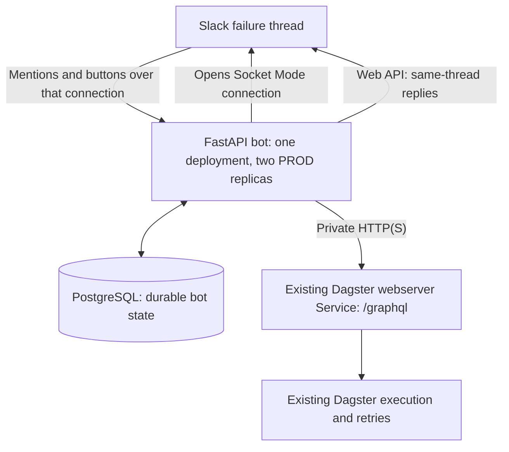

# Slackbot

A Slack operations bot for self-hosted Dagster, controlled through a FastAPI application in the same Kubernetes cluster.

**Status: OpenSpec planning complete; implementation pending.** The repository contains the proposal, six capability specs, detailed HLD/LLD and 56 unchecked implementation tasks.

## OpenSpec entry points

| Document | Purpose |
|---|---|
| [Proposal](openspec/changes/add-dagster-slackbot/proposal.md) | Why, scope and capability inventory |
| [Capability specs](openspec/changes/add-dagster-slackbot/specs/) | Required behavior with WHEN/THEN scenarios |
| [Design](openspec/changes/add-dagster-slackbot/design.md) | Architecture, decisions, trade-offs and complete technical detail |
| [Tasks](openspec/changes/add-dagster-slackbot/tasks.md) | Implementation checklist and verification outcomes |
| [Workflow guide](openspec/README.md) | Tooling, validation and lifecycle conventions |
| [Project configuration](openspec/config.yaml) | Shared context and artifact rules |

The active change is `add-dagster-slackbot`, using the built-in `spec-driven` schema. Planned requirements are ADDED deltas in that change. `openspec/specs/` is intentionally empty until delivery and normal archive/sync; no implemented baseline is claimed.

## Recommended architecture



Each bot pod runs one Uvicorn process with async Slack SDK, HTTPX and Psycopg clients plus supervised durable-work loops. FastAPI calls the existing private Dagster Service; Dagster owns job execution. Use existing PostgreSQL infrastructure with a dedicated bot database/role.

No public ingress or runtime Teleport session is required for this workflow. Existing internal authentication and workload network restrictions remain in force. The actual Service address, deployed GraphQL schema, retry behavior and data policies are implementation verification inputs.

## Slack interaction

Reply in an existing Dagster failure thread:

```text
@bot logs
@bot status
@bot retry
```

The bot resolves the exact source run from the trusted alert. Retry offers whole-run re-execution or a fresh copy, then requester confirmation. Evidence, controls and progress remain in that thread. A bare `@bot` shows a menu.

Durable state prevents duplicate command handling and coordinates one active bot-created run family across replicas. Uncertain launches are reconciled without automatic resubmission. Phase one has no LLM; a later company AI gateway can reuse the same typed services and policies.

## Validate and continue

With Node.js 20.19.0 or later, run from the repository root:

```bash
npx --yes --package @fission-ai/openspec@1.13.2 openspec validate add-dagster-slackbot --strict --no-interactive
npx --yes --package @fission-ai/openspec@1.13.2 openspec status --change add-dagster-slackbot
npx --yes --package @fission-ai/openspec@1.13.2 openspec instructions apply --change add-dagster-slackbot
```

OpenSpec 1.13.2 strict validation passed for this planning change. A complete artifact status means the documents are present; implementation progress remains **0/56 tasks**. Begin with the environment contract tasks, then build and verify in dependency order.

The original [specification path](dagster_slackbot_spec.md) remains as a compatibility index. Its complete v0.3 technical content is carried forward in the OpenSpec design.
