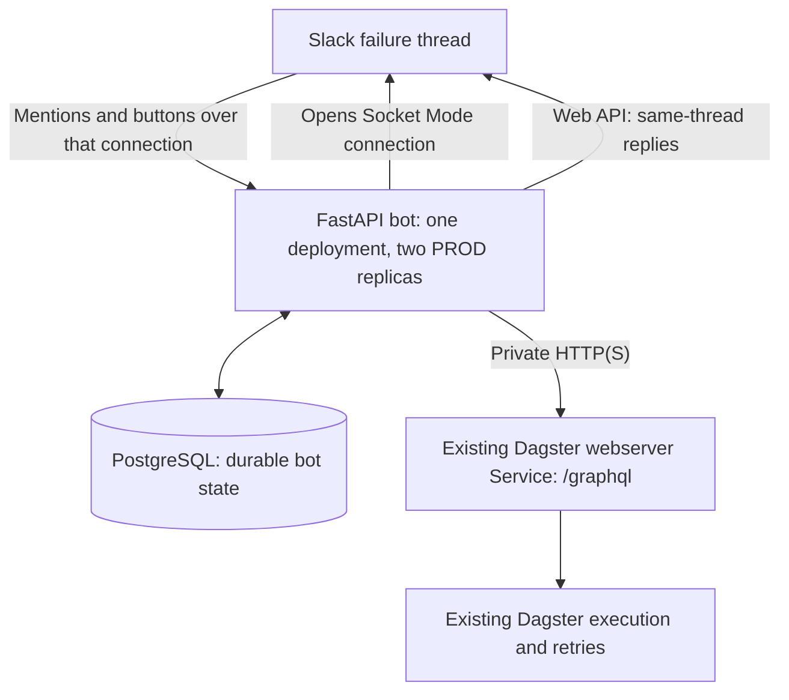

# Slackbot

Design specification for controlling self-hosted Dagster from Slack using an existing FastAPI application in the same Kubernetes cluster.

**Status: design v0.3.** This repository contains the specification; runnable bot code and deployment manifests are not implemented yet.

## Recommended architecture



FastAPI calls the existing Dagster webserver through its Kubernetes Service. For example, after substituting the actual Service name, namespace, cluster domain, port and authentication:

```text
DAGSTER_GRAPHQL_URL=http://dagster-webserver.dagster.svc.cluster.local:3000/graphql
```

Each bot pod runs one Uvicorn process. FastAPI lifespan owns an asynchronous Slack SDK Socket Mode connection, a pooled HTTPX Dagster client, and supervised database-backed work/reconciliation/notification loops. PostgreSQL provides durable receipts, confirmations, launch admission and recovery; use the existing company database platform with a dedicated bot database/role.

This needs no public ingress, runtime Teleport session, separate gateway or worker deployment, message broker, or Kubernetes job-creation permissions for the bot. Dagster retains responsibility for executing jobs. Keep existing internal authentication and enforce workload network access.

## Slack interaction

Reply inside an existing Dagster failure thread:

```text
@bot logs
@bot status
@bot retry
```

The bot resolves the exact run from the trusted root alert. Retry presents whole-run re-execution or a fresh copy, then asks the requester to confirm. All results and progress remain in that thread. A bare `@bot` shows an action menu.

## Reliability

- Two identical production replicas; DEV may use one.
- Persist accepted requests before acknowledging Slack.
- One active bot-controlled run family across all replicas, including automatic retries.
- Deduplicated commands/buttons and one automatic launch dispatch per operation.
- Reconcile uncertain launches; never blindly resend a mutation after a timeout.
- Preserve logical configuration and selections while validating against current deployed code.
- Supervise background loops and recover durable work after pod replacement.

Phase 1 uses deterministic commands without an LLM. A later company AI gateway can interpret mentions through the same typed services and confirmation rules.

## Detailed design

Read [the full high-level and low-level specification](dagster_slackbot_spec.md), especially:

- [Architecture and direct API access](dagster_slackbot_spec.md#5-hld-two-applications-direct-internal-api-access)
- [Dagster adapter and execution semantics](dagster_slackbot_spec.md#8-dagster-adapter-and-execution-semantics)
- [Durability and launch safety](dagster_slackbot_spec.md#9-durable-operation-model)
- [Kubernetes deployment and connectivity checks](dagster_slackbot_spec.md#14-kubernetes-deployment-and-operations)
- [Environment facts still to verify](dagster_slackbot_spec.md#19-remaining-questions-and-verification-register)

The company's deployed Dagster schema, Service details, Slack alert format and database guarantees must be verified before enabling production mutations. The design update has not changed the company cluster.
