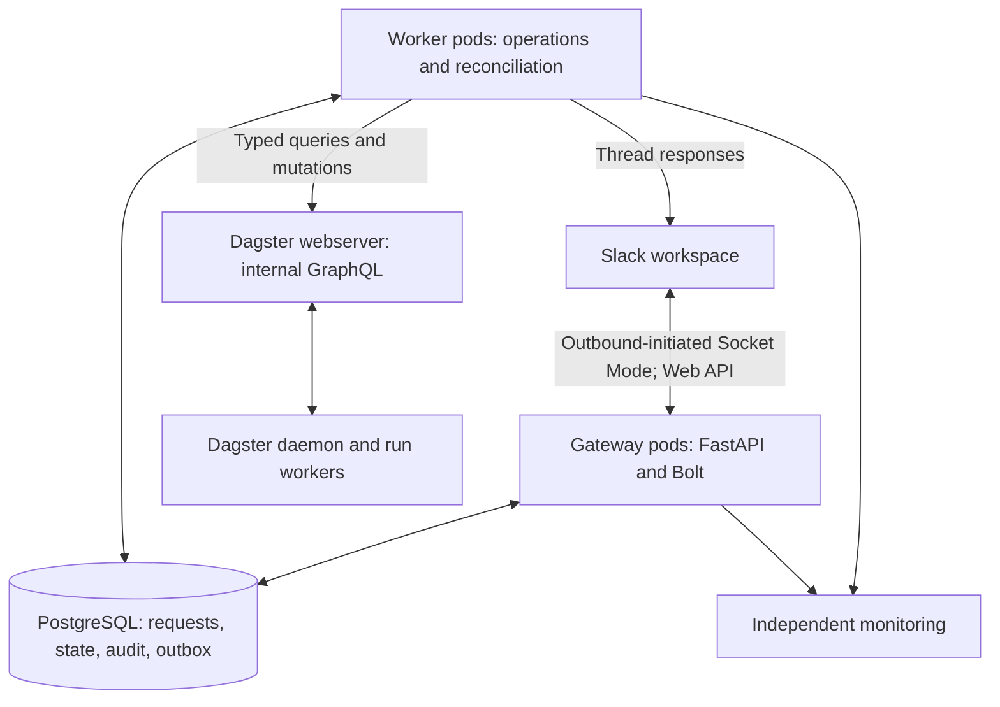
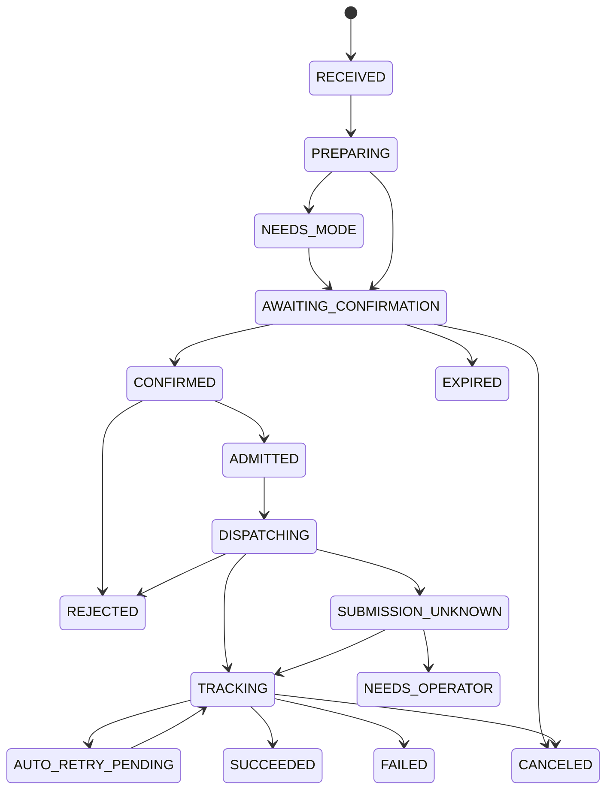
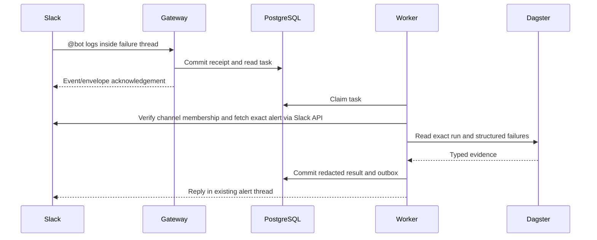

# Dagster Slack Operations Bot — HLD and LLD

Version: 0.2 — thread-mention interaction; detailed design draft for environment verification  
Prepared: 2026-09-23 UTC; revised: 2026-09-24 UTC  
Owner: requesting engineering team  
Implementation: Python, FastAPI, Slack Bolt, PostgreSQL, Kubernetes  
Phase 1: deterministic @bot commands inside failure threads; no LLM and no MCP  
Phase 2: optional natural-language understanding through the company AI gateway, using the same thread interface

## 1. Purpose and decision status

Provide a dependable Slack interface to inspect Dagster failures and perform explicit, traceable operational actions. Run the application in the same Kubernetes cluster as self-hosted Dagster. Use the internal Dagster webserver API, while employees continue using Teleport and port forwarding for their own access.

This document converts the user's answers into concrete design decisions. It is a specification, not a claim that the company's installation has been inspected or that any software has been deployed. No company endpoints, credentials, source repositories, or Slack messages have been accessed.

Decision labels:

- **Confirmed:** directly supplied by the user.
- **Default:** recommended implementation decision, delegated by the user; change through a documented revision if needed.
- **Verify:** deployment fact or API behavior that must be checked in DEV before enabling the affected capability in PROD.

Revision 0.2 incorporates the user’s explicit correction: invoke the bot by mentioning it inside the existing failure thread and keep the response there. This replaces the earlier slash-command/permalink workflow. Mentions are available in phase 1 and do not depend on an LLM.

### 1.1 Confirmed requirements

| Area | Requirement |
|---|---|
| Dagster | Self-hosted, Kubernetes; one production environment and one code location in scope |
| Connectivity | Bot in the same cluster; direct internal Dagster access is permitted |
| Existing access | Employees reach the webserver using port forwarding through their access workflow |
| Slack | One workspace; initially one channel, configurable allowlist for additional channels |
| Users and scale | Approximately 10 users and 100 jobs; critical operational availability |
| Invocation | Explicit @bot mentions inside failure threads in phase 1; deterministic commands now, LLM interpretation later |
| Existing alerts | Dagster already sends failure messages; visible text contains a run-ID suffix |
| Context | Operations should be associated with the existing failure alert's thread |
| Workloads | Mixed jobs/assets and ingestion workloads; user reports all are safe to rerun |
| Logs | Dagster structured errors and stack traces; no external investigation sources |
| Execution | Whole-run re-execution or a fresh run; preserve logical inputs, use latest deployed code |
| Existing automation | Dagster run retries already enabled |
| Admission | One bot-controlled run at a time; exact lifetime interpretation uses the default below |
| Authorization | Members of an allowed Slack channel may use its operations; one backend bot identity |
| Implementation | Python preferred; FastAPI was intended, not FastMCP |
| Testing | DEV environment available; requesting team owns implementation and operation |

### 1.2 Principal defaults

1. Use Slack Socket Mode: the application opens outbound HTTPS/WSS connections; no public ingress is needed.
2. Reply to a failure alert with `@bot logs`, `@bot status`, or `@bot retry`. Resolve the run from the thread’s root alert and keep replies, controls and progress in that same thread. No copied permalink is required.
3. Use deterministic parsing, buttons for mode selection and explicit confirmation, and no AI dependencies in phase 1.
4. All enabled channel members have the same permissions. Every mutation needs requester confirmation, expiring after five minutes; no second-person approval by default.
5. Use PostgreSQL for durable requests, operation state, admission control, audit events, and message delivery work. Do not add Redis or a separate broker initially.
6. Run two gateway pods and two worker pods, with a highly available PostgreSQL service and independent monitoring.
7. Hold one global launch slot until a bot-created primary run and its automatic-retry descendants have conclusively finished. Reads and cancellation remain available.
8. Never automatically resend a Dagster launch whose outcome is uncertain. Reconcile first; retain an explicit unresolved state when evidence is insufficient.
9. Preserve logical run configuration, partitions, selections, and applicable user/policy tags. Generate new execution identity and lineage fields correctly; do not copy stale execution bookkeeping.
10. Support a named, tested catalog of GraphQL-backed operations. Do not expose arbitrary GraphQL, shell commands, or direct Dagster database access.

## 2. Constraints that change the design

### 2.1 Mentions provide the required thread context

Subscribe to Slack `app_mention` events. For an invocation inside a failure thread, use the authenticated event's `channel` and `thread_ts` to identify the root alert, and `ts` to identify the command message. Read that root message and post replies using the same root timestamp [S3, S4, S21, S22].

The earlier slash-command limitation does not apply to mentions. A deterministic parser maps `@bot logs` or `@bot retry` to typed operations; an LLM is unnecessary. Phase 2 adds language flexibility without changing this entry point.

Ordinary run commands require an existing failure thread. A bare `@bot` there shows an action menu for that failure. An unthreaded operational mention receives guidance to reply beneath the failure alert; it must not choose the latest failure or create a run. Generic help can be answered beneath the unthreaded mention itself.

The new bot replies beneath the existing integration's alert but does not edit that alert. Its controls and updates belong to its own thread messages [S8].

### 2.2 Channel allowlisting is enforced in the application

Slack installation and invitation behavior is separate from our operation policy. An application cannot assume it will only be mentioned in the desired channel. Check workspace, app, and channel IDs for every command and interaction. Refuse unauthorized contexts before reading Dagster data.

The application will not claim it can prevent all invitations into other channels. Workspace administrators can additionally restrict app management. Self-leaving other channels is optional housekeeping and is not a security boundary.

### 2.3 A Dagster mutation is not an exactly-once API contract

The deployed GraphQL schema is not known. Current upstream source inspected during design does not establish a supported caller-chosen run ID or idempotency key for launch/re-execution. Dagster can persist a run before submission finishes; a timeout or generic error can occur after that point [S13, S14].

Consequently, an HTTP timeout is not evidence that nothing happened. This design promises durable intent, a single automatic dispatch attempt per operation, and explicit reconciliation. It does not promise distributed exactly-once execution or business-level data deduplication.

### 2.4 Dagster automatic retries remain authoritative

Dagster retries can create additional runs and rely on persisted intermediate outputs, depending on strategy [S10]. The bot must observe automatic retries rather than creating a second independent retry loop.

Whole-run re-execution is the default manual retry operation. Resume-from-failure is not initially enabled because the I/O manager and output persistence are unknown. The bot still needs to understand the existing automatic-retry configuration.

## 3. Scope and capability catalog

The broad requirement is to cover straightforward GraphQL operations. The following catalog makes that requirement testable. Every capability must pass schema and DEV contract checks. Missing optional capabilities are shown as unavailable, never approximated through private APIs.

### 3.1 Phase 1 operation catalog

| Command after @bot | Operations | Execution/response rule |
|---|---|---|
| `help`, `health`, `capabilities` | Usage; dependency health; enabled operations | Same-thread response; no infrastructure secrets |
| `jobs` | List jobs in configured code location; identify repository and partitioning | Paginated in the invoking thread |
| `runs`, `failed` | Bounded run list, status/time/job filters | Paginated in thread; never changes its bound run implicitly |
| `status` | Source run, step progress, timing, lineage, related operation and automatic-retry state | Run comes from root alert; same-thread reply |
| `logs` | Structured failure events, cause chain, stack frames of the root alert’s run | Redacted bounded reply in the same thread |
| `config` | Sanitized run configuration, selections, relevant tags | Same-thread safe summary; secret values withheld |
| `retry` | Select whole-run re-execution or fresh copy of the root alert’s run | Prepare, choose mode, confirm, submit one run; all in thread |
| `launch <job> --preset <name>` | Start a job using an owner-maintained validated configuration preset | Explicit partition when required; one run only |
| `cancel [run-id]` | Request supported graceful cancellation of one active/queued run | Select an exact source/related active run, confirm in thread, track actual terminal status |
| `assets`, `asset <key>` | List/inspect assets, materialization/check status | Bounded reads |
| `partitions <job-or-asset>` | List/validate existing partition keys | Paginated; no dynamic-partition mutation |
| `materialize <asset> --partition <key>` | Materialize one asset/partition through an explicit job/preset mapping | Only when adapter proves exactly one run with known config |
| `schedules`, `sensors` | List and inspect definitions/state/ticks | Bounded reads |
| `schedule start/stop <name>` | Set one schedule's desired state | Confirmation; explain future execution effect |
| `sensor start/stop <name>` | Set one sensor's desired state | Confirmation; cursor unchanged |
| `operation <id>` | Read durable operation/notification status; recover a pending confirmation | Must belong to the current channel/thread; confirmation restricted to requester |
| `bind <full-run-id>` | Exceptional fallback when the trusted alert has no complete run identifier | Show evidence and explicitly confirm the binding; never replace a verified binding silently |

All command names above follow the actual bot mention. For `logs`, `status`, `config` and `retry`, the root alert is the default target; users do not repeat its run ID. For `cancel`, offer eligible active descendants or require the exact ID if there is ambiguity, and show it before confirmation. Definition-level actions such as schedule control keep their explicit named target. General help/listing may run in the thread of a top-level mention; failure-specific operations require the trusted failure root.

The root alert remains bound to its original failure even after new runs start. `status` can show the source and its recovery operations, but `logs` and `retry` must not silently switch to the newest child. Any child-run targeting requires explicit selection and is recorded on that operation without rewriting the original thread binding.

### 3.2 Scope boundaries

No bulk retries, multi-partition backfills, arbitrary GraphQL input, run deletion, asset wiping, code-location reload/shutdown, run-status force marking, force termination, schedule definition editing, sensor cursor edits, arbitrary configuration pasted into Slack, or external log-system access in phase 1.

These are explicit boundaries around operations that require additional semantics or wider effects, even if a GraphQL mutation exists. A future scope revision can add named operations with their own preparation, authorization, reconciliation, and acceptance tests.

Asset materialization and direct job launch are disabled until usable presets/mappings exist. The failure-log and retry workflows must not depend on those optional mappings. No new Dagster schedule, sensor, or backfill is created by a retry.

One run does not necessarily mean one asset or one partition. A non-subsettable multi-asset can affect additional assets, and a source run can cover a partition range. Preview the complete effect and validate it against the named operation's scope. The single-asset materialization command refuses expanded effects. Retrying an existing range run requires an explicitly supported preview of the entire original range; otherwise refuse rather than reduce or expand it silently.

### 3.3 Enabling schedules/sensors and the one-run limit

Enabling a schedule or sensor can cause Dagster to create multiple future runs. Such runs are outside the bot's single-launch slot. The confirmation explicitly states this. If the requirement is actually one run across the entire Dagster instance, the design must add Dagster coordinator/concurrency configuration; bot-level locking cannot enforce it.

## 4. User experience

### 4.1 Basic interaction

The person opens the existing Dagster failure thread and replies:

```text
@bot logs
@bot status
@bot retry
@bot help
```

`@bot` is the human-facing placeholder for the installed app's actual mention. Slack delivers its stable bot-user ID in a mention token. No failure URL or run suffix is required in the normal command.

Example in the original failure thread:

```text
Person: @bot logs
Bot:    Failed step: ingest_orders. Error: <redacted structured exception>.

Person: @bot retry
Bot:    Retry orders_ingestion, run <full-run-id>?
        [Re-execute whole run] [Launch fresh copy]
Person: Selects Re-execute whole run.
Bot:    PROD; same configuration and partition; current deployed code.
        [Confirm] [Cancel request]
Person: Selects Confirm.
Bot:    Created run <new-run-id>; queued. I’ll update this thread.
Bot:    Run completed successfully.
```

All bot cards and operational results are replies to the original failure alert, with `reply_broadcast=false`. Transport acknowledgement is invisible to the person; a visible receipt or result is a separate Slack Web API message. Avoid a redundant receipt for fast reads; use a short durable `Checking this failure…` message when useful for a longer operation. Never claim acceptance before persisting its receipt.

A log response includes job/PROD, full run ID, failed step, exception and short cause/stack evidence, automatic-retry state, requester and operation ID. Include a human-access link when configured and a redaction/truncation notice when applicable. Do not generate root-cause explanations beyond Dagster evidence.

Phase-1 grammar is finite and case-insensitive after the bot mention: `logs`, `status`, `retry`, `help` and the catalog above. A small documented alias table may map `error`/`show logs` to `logs` and `rerun` to `retry`. An empty mention shows the action menu; unknown wording returns help in the same thread. Do not execute unmentioned replies, infer intent from arbitrary prose, or treat a plain `yes` as confirmation.

### 4.2 Retry preparation and confirmation

1. Resolve the target and verify the source run belongs to configured PROD/code location.
2. Show two mode choices in the same failure thread: **Re-execute whole run** and **Launch fresh copy**. Explain the lineage distinction in one sentence.
3. Build a mode-specific preview from current Dagster metadata. Include job, exact source run, partition/selection, latest-code policy, applicable retry policy, and any incompatibility.
4. Present **Confirm** and **Cancel request** buttons in that same thread. Confirmation is bound to the requester, workspace/channel/root-thread, operation, chosen mode, preview hash and five-minute expiry.
5. On confirm, persist confirmation durably. Worker rechecks permissions, target state, config compatibility, code identity where observable, automatic retries and the launch slot.
6. If the preview changed materially, return to preparation and require confirmation of the changed preview. Never execute a different action under an old approval.
7. On successful run creation, post a status card into the original thread and update it as the run family progresses. Final completion includes primary and relevant retry run IDs.

Buttons support the thread-mention workflow without requiring language interpretation. Mode selection and confirmation remain visible in the original thread; only the original requester may operate that proposal. An unauthorized click gets a private denial and does not mutate the shared card.

Cards are persistent bot-owned replies. Use `chat.postMessage(channel=channel_id, thread_ts=root_ts, reply_broadcast=false)` to create them and `chat.update` to update only the saved bot message. Disable controls after consumption/expiry and invalidate old nonces server-side even if a Slack update fails. `@bot operation <id>` in the same thread can recover an unexpired proposal for its requester.

The database is authoritative. Deleting a message does not cancel an already confirmed run; editing command text does not change a saved action. `Cancel request` cancels an unsubmitted proposal, while `@bot cancel` is the explicit Dagster-run cancellation operation. Button acknowledgement confirms transport receipt; the thread card supplies the visible result. No modal or persisted Slack `response_url` is required.

### 4.3 Useful refusal messages

| Situation | Behavior |
|---|---|
| Failure command is not in a failure thread | Ask the person to reply beneath the failure alert; do not choose latest |
| Existing automatic retry active/pending | Show its run/state; do not create a second retry |
| Other bot-controlled run active | Show busy operation/run; do not put a production launch in a delayed queue |
| Unresolved earlier submission | State that execution is being reconciled; block new launch admission |
| Run ID suffix ambiguous/incomplete | Ask for exact run ID or alert-format fix |
| Config incompatible with latest code | Show sanitized validation errors; no mutation |
| Member removed before execution | Deny action and expire confirmation |
| Dagster accepted but execution queued | Say `Queued`, not `Running` or `Succeeded` |
| Slack delivery failed after launch | Keep monitoring; retry only notification work |

## 5. HLD



The gateway and worker deployments use one codebase/image with different entrypoints. PostgreSQL is a separate service, preferably the company's existing HA platform. Use a dedicated bot database/schema and database role; never write Dagster's storage tables directly.

### 5.1 Component responsibilities

| Component | Responsibilities | Must not do |
|---|---|---|
| Slack gateway | Transport verification, local allowlist checks, parsing, durable receipt, fast acknowledgements, health | Execute Dagster operations inline or keep sole operation state in memory |
| Application services | Authorization, target resolution, preparation, confirmation, policy, admission | Trust client-supplied actor/target changes or expose arbitrary query execution |
| Dagster adapter | Versioned GraphQL documents, union/error mapping, canonical run snapshots, retry-family observations | Execute jobs locally in the bot process |
| Workers | Claim durable work, prepare/execute/read, reconcile runs, deliver outbox | Blindly retry uncertain launch mutations |
| PostgreSQL | Source of truth for intents, operation lifecycle, fences, slot, audits and outbox | Serve as a substitute for Dagster run state |
| FastAPI | Lifespan management, health/readiness/metrics and narrow internal diagnostics | Public unauthenticated mutation API |

### 5.2 Connectivity options

| Option | Fit | Requirements | Decision |
|---|---|---|---|
| Socket Mode | Private VPC workload with allowed egress | Slack HTTPS/WSS, app-level token, reconnect handling | Default |
| Public HTTPS callbacks | Company already provides approved ingress | TLS, signature/timestamp verification, rate limiting, only Slack routes exposed | Supported transport alternative |
| Approved egress proxy with Socket Mode | Direct internet egress disallowed | HTTPS/WSS proxy support and tested reconnect behavior | Supported deployment variation |
| External ingress relay | Neither normal route available | Additional trusted service, actor integrity and replay design | Requires separate design; not initial implementation |

Changing Slack transport does not expose Dagster publicly. Teleport is not in the bot's runtime data path under the confirmed direct-access policy. No unattended employee `tsh` session is used. If that policy changes, add a service identity/Teleport access adapter and revalidate connectivity.

### 5.3 Internal service identity

Use a dedicated Kubernetes service account, network policy, workload labels and any existing internal authentication mechanism. A Kubernetes service account alone does not automatically authenticate HTTP requests to an otherwise unauthenticated Dagster webserver. Verify whether a proxy, mTLS, header-based identity or plain network access is actually used.

Only worker pods require mutation access to Dagster. Use a configured internal service address; never derive API destinations from Slack input. Record the verified human actor in the bot audit ledger. Bot-written Dagster tags aid correlation, but are not a substitute for backend authorization or a tamper-proof audit log.

## 6. Slack integration and target resolution

### 6.1 App configuration

Create one internal PROD app and a separate DEV app/token/channel configuration. Give them distinct names and bot-user IDs (for example `@dagster-bot` and `@dagster-dev`) so a mention clearly selects the app. Verify each token's bot identity during startup. Enable Socket Mode, subscribe to the `app_mention` bot event, and enable interactive buttons.

| Credential/scope | Purpose |
|---|---|
| App token: `connections:write` | Open Socket Mode connections |
| Bot token: `app_mentions:read` | Receive direct mentions, including failure-thread commands |
| Bot token: `chat:write` | Post/update same-thread cards, evidence and progress |
| `channels:read`, `channels:history` | Only if public allowed channels are used; verify members/read root alert |
| `groups:read`, `groups:history` | Only if private allowed channels are used; verify members/read root alert |

Request only the public/private variants needed. Install the bot in each allowed channel. The baseline has no slash command, `commands` scope, user token, DM subscription, general `message.channels`/`message.groups` subscription, file upload scope or `chat:write.public`. Explicit mentions are sufficient [S2, S3, S5, S21, S23].

Events and history access are separate: `app_mention` delivers the command, while channel-history permission lets the application read its root alert. It need not ingest all channel messages or fetch the whole conversation.

### 6.2 Inbound verification

Socket Mode: accept events through the SDK's authenticated connection; validate configured `team_id`, `api_app_id`, channel and supported payload type. Preserve transport identity into the application context. In HTTP mode, verify Slack signatures against the original raw body and reject stale timestamps before parsing business input. Never use a deprecated verification token.

Accept new human `app_mention` messages for this bot only. Requester identity is `event.user`, never `authorizations[].user_id` from the installation envelope. Ignore self events, other bot-originated commands (`bot_id`/`bot_profile`), absent human requester IDs, message edit/delete events, unsupported subtypes and hidden/system events. Keep the SDK's self-event filter enabled. Ordinary unmentioned thread replies are not commands. These rules apply to the invoking event, not to the root failure alert, which is expected to be bot-authored.

Extract and remove the exact `<@BOT_USER_ID>` mention token; do not rely on display-name text. Bound command length, reject unknown flags and parse the remainder through a finite grammar. Preserve Slack timestamps as strings. An edited command never creates or changes a mutation; the person must send a new explicit command and confirm its own proposal.

### 6.3 Root alert resolution algorithm

1. Build the context from authenticated `team_id`, `event.channel`, `event.user`, `event.ts` and `event.thread_ts`. The root is `event.thread_ts`; the invoking command timestamp is `event.ts`.
2. For failure-specific commands require a thread reply: root timestamp exists and differs from the command timestamp. Do not use `event.ts` as an implicit failure root when thread context is absent. Validate workspace/channel allowlists and current requester membership.
3. Fetch the exact root alert through `conversations.history(channel, latest=root_ts, inclusive=true, limit=1)` and require the returned timestamp equals `root_ts`. The command reply and neighboring messages must never be mistaken for the alert [S3]. A validated cached binding can reduce repeat reads, subject to mutation revalidation.
4. Match the root's configured trusted publisher `app_id`/`bot_id` and expected alert shape. Do not apply the human-command bot filter to this alert.
5. Inspect the root's text, blocks and attachment link targets. A short visible run label may link to the full Dagster UUID.
6. Extract a full run identity from trusted configured link patterns or fields. Do not follow arbitrary user URLs or execute text in the alert.
7. Query the configured Dagster endpoint for that exact run and validate environment, code location/repository/job and supplied partition metadata.
8. Persist `(workspace, channel, root_ts) -> source_run_id` with publisher/evidence hash and resolution method. Keep `command_ts` and event ID per operation for audit and deduplication.
9. Route all operational replies and interactive cards to the same validated root. Verify interaction payload channel/thread against the saved operation; a button value cannot redirect it.

No copied permalink and no full-thread transcript are needed. The root can be read directly even when the mention is several replies into the thread. Top-level informational mentions may receive help beneath their own `ts`; they never implicitly bind a failure.

If the root is missing, untrusted or points to multiple runs, stop automatic resolution and explain the issue in that same thread. Never fall back to the latest failure. Editing the root cannot silently retarget an established binding.

### 6.4 Short run-ID handling

A suffix is a display convenience, not an execution identity. Do not issue a mutation using an assumed first, newest, or apparently unique suffix match from an incomplete search.

Preferred resolution: update the existing alert publisher to embed a full run UUID in a link/field while leaving its short visible label unchanged. This requires a small publisher change only if the full UUID is currently absent.

Fallback: ask for `@bot bind <full-run-id>` in the same thread. Check the exact run and available alert evidence, then show job/time/partition and require confirmation of this manual mapping. Record requester-supplied provenance distinctly from publisher-verified identity; never overwrite an existing verified binding or silently accept a mismatch. Suffix search may assist bounded discovery but cannot establish global uniqueness. This is an exceptional recovery path, not the normal interaction.

The baseline bot does not need to consume all channel messages or scrape history. No root message or alert publisher change is made by this specification itself.

## 7. Authorization and confirmation policy

### 7.1 Authorization formula

```text
allowed =
  authenticated_slack_transport
  AND configured_app_and_workspace
  AND invoking_channel in configured_channel_allowlist
  AND target_channel == invoking_channel
  AND target_root_thread == authenticated_invocation_root_thread
  AND bot_is_member_of_channel
  AND requester_is_current_member_of_channel
  AND target_is_within_configured_Dagster_scope
  AND capability_is_enabled
```

Use `conversations.members`, following pagination, to verify the human requester [S5]. `conversations.info.is_member` describes the API token holder and does not prove the requester is a member. Verify channel properties separately [S6].

Default channel policy: company-controlled, non-Slack-Connect channel. Recommend a private channel if membership is intended to be an access grant. If a publicly joinable channel is chosen, every person who joins gets the stated operational rights; the application does not introduce a hidden engineering-only role.

Read membership cache TTL: at most 30 seconds. Mutations use a fresh membership check immediately before execution; unavailable membership checks deny or defer without execution. This is authorization at dispatch time, not an atomic guarantee against a person being removed a millisecond later.

No separate Teleport login is required for a Slack requester under the user's chosen policy. The backend service identity and human action attribution remain distinct.

### 7.2 Confirmation policy

| Action | Confirmation |
|---|---|
| Reads | None after authorization |
| Run launch/re-execution/materialization | Requester confirms exact preview; five-minute expiry |
| Cancellation | Requester confirms exact active run |
| Schedule/sensor state change | Requester confirms desired state and future-run effect |
| Recovery of an uncertain launch | Platform operator procedure; not an ordinary Confirm button |

Only the requester can confirm their prepared mutation. Any other authorized member may create their own request, but cannot confirm another person's card. Single-use nonce, operation state, request hash, actor, bound root thread, saved bot-owned card timestamp and expiry are checked atomically. Reject another person's click without consuming the requester's nonce. The preview contains no secrets.

Store only an opaque operation reference and single-use interaction reference in button values. Authoritative target/configuration comes from the database. Client-provided job names, roles, mode changes or user IDs never override the saved preview.

## 8. Dagster adapter and execution semantics

### 8.1 Version and capability contract

Dagster documents that its GraphQL API can have breaking changes [S9]. Before implementation is considered complete:

1. Record webserver, daemon and code-location package versions plus chart/release information.
2. Capture the DEV GraphQL schema, or an administrator-provided equivalent if introspection is disabled.
3. Pin supported query/mutation documents and map every success/error union member used.
4. Verify DEV/PROD schema and relevant configuration equivalence.
5. Check version/schema compatibility at startup. Disable affected mutations on mismatch; retain compatible diagnostics.

Do not execute `execute_job()` locally or mount application code into the bot to run jobs. Dagster's configured control plane/run launcher remains responsible for execution.

### 8.2 Application interface

These are our typed adapter contracts, not a promise that identically named GraphQL fields exist:

```python
class DagsterPort(Protocol):
    async def capabilities(self) -> CapabilitySet: ...
    async def get_run(self, run_id: str) -> RunSnapshot: ...
    async def list_runs(self, filters: RunFilters, cursor: str | None) -> RunPage: ...
    async def get_failures(self, run_id: str, cursor: str | None) -> FailurePage: ...
    async def observe_retry_family(self, run_id: str) -> RetryFamilySnapshot: ...
    async def validate_launch(self, plan: LaunchPlan) -> ValidationResult: ...
    async def reexecute_all(self, plan: LaunchPlan) -> SubmissionResult: ...
    async def launch_fresh(self, plan: LaunchPlan) -> SubmissionResult: ...
    async def find_operation_runs(self, operation_id: str) -> list[RunSnapshot]: ...
    async def cancel_run(self, run_id: str) -> CancellationResult: ...
    async def get_automation_state(self, target: AutomationTarget) -> AutomationState: ...
    async def set_automation_state(self, target: AutomationTarget, desired: bool) -> MutationResult: ...
```

`RunSnapshot` includes full ID, code location, repository/job, status, timestamps, parent/root IDs, selections, partition metadata, applicable tags, config hash and observed code identity if available. Sensitive config is handled separately, not logged with this object.

### 8.3 Re-execution versus fresh copy

| Property | Whole-run re-execution | Fresh copy of source run |
|---|---|---|
| New run ID | Yes | Yes |
| Code | Current deployed code | Current deployed code |
| Source relationship | Dagster parent/root lineage retained as supported | New Dagster root; source retained only as bot provenance |
| Logical configuration | Source configuration, validated against current definition | Same |
| Partition/asset selection | Preserve source intent; verify supported behavior | Preserve source intent explicitly |
| Step execution | Whole eligible execution, not resume-from-failure | Fresh execution of the copied selection |
| Automatic-retry accounting | Existing lineage can affect retry budget; verify installed behavior | New lineage may receive a new retry budget |
| Successful outputs reused as retry inputs | Not intentionally used for a from-failure resume | Not intentionally used for a from-failure resume |

The phrase “preserve everything” refers to logical inputs. New run IDs, timestamps, system lineage/retry bookkeeping and bot operation tags must change. Preserve configured user tags and required partition/retry-policy tags through an explicit adapter policy. Do not copy stale `will_retry`, retry counters, retry-child pointers, historical bot operation IDs or internal resume markers blindly. Preserve their business intent through Dagster-supported inputs.

Source config can reference environment variables or secrets that resolve to newer values at execution time. Latest code and changing external ingestion inputs mean identical configuration is not a byte-for-byte historical replay. No old image is automatically restored.

Check source configuration/tags for launcher or container-image overrides. If preserving an override would execute historical code, the requirements conflict: reject and explain the conflict rather than silently changing input or executing the old image. Verify the actual launcher behavior in DEV; current webserver metadata alone does not prove which container image executes.

For source runs with partial step selections, explicit asset checks, dynamic partitions or backfill-related tags, verify how each field maps into a whole re-execution. If intent cannot be represented faithfully, refuse that operation rather than silently broadening it. Parent lineage and source-provenance tags do not alone preserve execution selection.

Retrieve complete source selection/configuration, not truncated UI display fields. Preserve the distinction between null and empty asset-check selection. Current upstream convenience re-execution logic can reconstruct a selector without the parent's op subset; do not apply that shortcut universally. Contract-test subset workloads, and use explicit supported selector/configuration inputs when required. Do not send both alternative re-execution input forms in one mutation.

### 8.4 Proposed query/mutation coverage

Maintain documents under `adapters/dagster/graphql/<supported-version>/`. The deployment's schema determines exact fields. Expected coverage includes run lookup/listing, structured run events, repository/job metadata, config validation, run launch, run re-execution, termination, schedules/sensors and asset metadata. Common upstream names such as `launchRun` and `launchRunReexecution` are starting points for verification, not untested contracts.

Use explicit variables and enums, bounded pagination, union decoding, request timeouts, and a capability inventory. A successful HTTP response with GraphQL errors is not a successful operation. A generic `PythonError` after a launch is not automatically a pre-submission rejection.

### 8.5 Automatic-retry policy

- Before preparing and again before dispatch, inspect the source run's descendants and retry-pending state.
- If an automatic retry is queued/running/pending, show it and refuse a duplicate manual launch.
- If a retry already succeeded, do not silently retry the older failure. Offer fresh preparation with explicit acknowledgement of the recovered state.
- Preserve existing retry-policy tags/configuration. Do not disable automatic retries or reset counters merely to satisfy bot concurrency.
- Manual re-execution and fresh-copy modes may have different retry budgets. Show verified installed behavior in the preview; do not invent a remaining-attempt count.
- Track the newly created primary run and its actual automatic-retry descendants, not every branch sharing an old root run group.
- Hold admission while a retry is pending even if the previous attempt is terminal. If pending/exhausted state cannot be established, keep the slot blocked and escalate.

Only terminal failure states are default eligible for manual retry; canceled/successful source runs require a fresh-copy flow that explicitly displays source status. Active runs cannot be cloned/re-executed through a casual retry request.

Runs belonging to an active backfill are not eligible for bot relaunch in phase 1. Native re-execution can interact with backfill tags/bookkeeping; an explicit backfill-coordination design is required before enabling this case. For completed backfills, verify tag filtering and original selection before permitting a standalone copy.

## 9. Durable operation model

### 9.1 State machine



Reads use the same durable receipt/audit system but finish after result generation. `REJECTED` after dispatch is only valid for a documented, proven no-side-effect rejection. All other ambiguous outcomes enter `SUBMISSION_UNKNOWN`.

Slack delivery state is separate from operation/execution state. A run can succeed while its notification is pending; this must not change the run operation back to ready-to-dispatch.

### 9.2 Storage schema

| Table | Key fields and purpose |
|---|---|
| `inbox_receipt` | UUID; payload kind; unique workspace/event ID for Events API or action identity for interactions; app/channel/actor IDs; root-thread and command timestamps; normalized command; received time; receipt status |
| `operation` | UUID; source receipt; kind; actor/channel/thread; full source run; mode; state; state version; preview/config hashes; expiry; confirmed time; dispatch marker; primary run ID; last observation; terminal result |
| `dispatch_attempt` | Unique operation ID; unique dispatch UUID; immutable request hash; submitting worker/pod UID; lease generation; committed marker time; immutable response evidence; exactly one automatic attempt per operation |
| `confirmation` | Operation; hashed single-use nonce; requester; preview hash; expiry; consumed time; unique consumed transition |
| `launch_slot` | Singleton scope key `prod:<location>`; owning operation; state; admission time; last verified family observation; version |
| `work_item` | UUID; operation; work kind; ready time; lease owner/expiry/generation; attempt count; state; unique logical work key |
| `run_observation` | Operation/run ID; parent/root IDs; observed status; retry linkage; timestamps; redacted event identifiers |
| `thread_binding` | Unique workspace/channel/root timestamp; full source run; trusted publisher; evidence hash; resolved time |
| `slack_outbox` | UUID; operation; channel/thread and optional private recipient; visibility; logical message key; payload revision; delivery status; Slack message timestamp; retry schedule |
| `audit_event` | Append-only ID; operation; actor; event; redacted target/decision; timestamp; trace ID; previous/current state versions |
| `config_snapshot` | Operation; encrypted sensitive launch snapshot if stored; logical hash; creation and purge times; key reference |

Use timezone-aware UTC timestamps. Keep Dagster UUIDs and Slack IDs/timestamps as strings. Enforce foreign keys, unique event/work/message keys and legal state transitions. Store machine-readable enums, not only prose logs.

Use a separate audit database role/permissions or external append-only audit export so normal application operations cannot silently edit audit history. This is operational tamper resistance; database administrators remain privileged.

### 9.3 Dedupe keys

Deduplicate `app_mention` deliveries by `(workspace_id, event_id)` and retain `(channel_id, command_ts, root_thread_ts)` for audit. An event redelivery is the same command; two separately posted mentions are distinct receipts. Socket `envelope_id` acknowledges a transport delivery and is not a substitute for event identity. Button interactions use their own stable action/operation identity and single-use confirmation nonce. Test the chosen SDK retry behavior and avoid storing raw secret-bearing payloads.

Unique confirmation consumption and operation state transitions are the final protection against double-clicks and repeated interaction deliveries. Never deduplicate all identical command text from a user indefinitely; a later intentional new run is a different request with a new confirmation.

Changing mode is allowed only before confirmation and generates a new preview version/nonce while invalidating earlier ones. A late mode-selection click must never alter a confirmed/admitted/dispatched operation.

### 9.4 Ingress acceptance

Separate transport acknowledgement from user-visible replies. An Events API/Socket Mode acknowledgement does not display an ephemeral command response. User-visible receipt/results are posted with `chat.postMessage` into the saved root thread after policy checks; button callbacks also receive their own protocol acknowledgement.

For accepted mentions, perform fast local validation, commit a deduplicated receipt and work item under a bounded database deadline, then acknowledge the event/envelope. No Slack history or Dagster calls occur on this path. Under HTTP mode acknowledge the Events API request; under Socket Mode acknowledge the envelope. Reject/ignore unsupported or disallowed events promptly without creating work or causing repeated retries.

Do not assume persistence inside an ordinary Bolt event listener happens before acknowledgement: event listeners may be auto-acknowledged by the SDK. Put the small durable-ingress step in the receiver/pre-ack path, or use verified SDK configuration/middleware with a contract test proving its ordering. Never let both a receiver and a listener enqueue the same command independently.

Target normal acknowledgement under one second, within the platform's three-second deadline [S2, S7]. Start with a 500 ms database deadline and verify it in DEV. An ACK signifies durable receipt only; it does not signify authorization, confirmation or launch.

If a durable write is known to fail, do not claim acceptance. Use transport-appropriate retryable failure (HTTP non-success or no successful Socket envelope ACK) and independent health alerting; Slack retries are finite and do not guarantee eventual delivery. A best-effort unavailable reply may be posted in the validated source thread without disclosing Dagster data. If commit outcome is uncertain, recover the same event/operation identity rather than creating a replacement. Do not acknowledge before persisting merely because an SDK defaults to doing so.

Confirmation durability remains unchanged: atomically consume the bound nonce and persist the transition/work before successful acceptance. Visible card updates happen separately. Missing acknowledgement or a missing reply does not prove a request was absent; deduplication and operation status resolve that ambiguity.

### 9.5 Admission and single automatic dispatch

The following is implementation pseudocode; the final code must use actual database constraints and compare-and-swap updates.

```text
prepare:
  verify current member and exact target
  fetch current source, definition, config and retry family
  validate supported mode and current schema
  save immutable preview + expiry

confirm:
  bind actor/channel/nonce to saved preview
  atomically consume nonce, set CONFIRMED, enqueue admission work, append audit

admit:
  recheck membership, source state, retry family, code/config validity
  transaction:
    lock operation and singleton launch_slot
    reject if another slot owner exists
    require still-confirmed state and valid preview
    set slot owner and operation ADMITTED

dispatch:
  do final external prechecks without holding a long database transaction
  if preview changed: release unused slot and require a new preview/confirmation
  transaction:
    require operation ADMITTED and its slot ownership/version
    require current submitting worker and nonexpired work lease generation
    set DISPATCHING and persist a unique dispatch-attempt marker
    commit before the external mutation
  require positive confirmation that this marker transaction committed
  make exactly one automatic mutation invocation for that dispatch marker
  record known result, or mark SUBMISSION_UNKNOWN
```

Only a worker that successfully creates the dispatch marker may make that invocation. Disable automatic HTTP/proxy retries for GraphQL POST mutations on this path. A process crash after marking but before sending may leave an operation unresolved without launching anything; that is preferable to automatic duplicate launch and is part of the documented recovery tradeoff.

An ambiguous marker commit does not authorize sending. The worker stops before the external call; recovery inspects the same operation and follows the unresolved-dispatch procedure rather than granting another attempt. Claim safe tasks using short transactions with `FOR UPDATE SKIP LOCKED`, increment a lease generation on each claim, and require that generation on updates [S19]. A stale pre-dispatch worker cannot claim the dispatch marker after its task was reassigned.

Preparation/reads/outbox work can be lease-retried. Dispatch work cannot be reassigned for another launch simply because a lease expired. PostgreSQL fencing protects database writes; Dagster does not validate our fence, so it cannot prevent a previously paused worker from later sending an already-authorized request. Unknown recovery must account for that worker.

Final membership, policy and source/retry checks must be recent at marker creation; use an initial maximum precheck age of five seconds and revalidate after longer waits. A late response from a stale worker can append immutable evidence identified by its dispatch ID; it cannot overwrite newer operation state. Record the submitting pod UID/process identity to support isolation during recovery.

## 10. Reconciliation, concurrency and recovery

### 10.1 Correlation tags

Add reserved application tags such as `opsbot/operation_id`, `opsbot/dispatch_id`, and `opsbot/source_run_id`. Overwrite historical bot operation tags on the new primary run. Avoid full Slack message bodies or credentials in tags.

The exact tag keys and propagation behavior are verified in DEV. Tags aid discovery and may be inherited by automatic retries; they are not a uniqueness constraint.

### 10.2 Unknown launch reconciliation

1. Query by operation/dispatch tags using the configured Dagster endpoint.
2. Compare candidate job, code location, config/selection hash and expected parent relationship.
3. For re-execution, identify the new primary whose parent is the intended source. For fresh launch, identify the new root with the expected provenance. Verify installed schema behavior.
4. Separate the primary from its automatic-retry descendants. Multiple tagged runs can be a valid retry family; multiple competing primaries are an anomaly.
5. If one valid primary exists, persist it and track its state, including `NOT_STARTED` or queued states.
6. If none appears, continue bounded read polling with backoff. An empty query result is not proof that the original request cannot still complete.
7. If there are inconsistent candidates, unavailable evidence or prolonged uncertainty, set `NEEDS_OPERATOR`, retain the launch slot and alert the team.

Never issue a second launch as a query-reconciliation action. A run created but not successfully submitted is an operator incident; do not create a new run to hide it.

### 10.3 One-at-a-time semantics

Default: at most one active bot-created primary run/family for the configured production scope. The slot is held through queueing, starting, running, cancellation pending, automatic-retry gaps and submission uncertainty.

Reads do not acquire the launch slot. Cancellation can target its current run without waiting for the slot to become free. Schedule/sensor controls use their own per-target serialization. Their indirect runs, other people using the UI, and schedules/sensors are not governed by this slot.

The bot rechecks for existing automatic retries immediately before launching, but a remote daemon can race with that check. Eliminating all overlap requires Dagster-side coordination/concurrency changes or an atomic server-side launch contract. This draft does not claim a database lock in the bot solves that remote race.

Do not release the slot after an arbitrary short quiet period. Release only when the primary and tracked descendants are terminal and the verified Dagster retry state establishes no pending retry. If the deployment cannot expose that fact reliably, use a documented Dagster-side coordination mechanism or keep this as a launch-readiness blocker.

### 10.4 Operator procedure for an unresolved launch

1. Disable new dispatch through the internal operational switch and preserve the ledger.
2. Identify the original submitter. Terminate/isolate it as needed so a paused process cannot later send its old request. Account for in-flight network requests.
3. Inspect Dagster run storage through supported UI/API evidence and operation tags, including new/stuck runs and retry lineage.
4. Attach an existing run when positively identified, or resolve the incident as no launch only with sufficient evidence and an audit reason.
5. If a new attempt is desired, create a new explicitly confirmed operation. Do not reset the old operation to ready-to-send.
6. Release the slot only after the old dispatch/family is resolved; record who made the decision and why.

This recovery is an owner/operator capability exposed through a controlled runbook/tooling path, not unrestricted Slack-channel membership. That distinction concerns reconciliation of system failures, not ordinary run permissions.

### 10.5 Outbox and Slack delivery

Persist logical notification work in the same transaction as the operation transition it reports. A worker posts/updates the bot-owned status card and stores the returned timestamp. Status updates are coalesced; send a final reply for terminal outcome.

Respect Slack `Retry-After` and per-channel limits [S11]. Suggested status update cadence: at most one update per 15 seconds per operation; start/end transitions have priority. Do not stream stack traces repeatedly.

An initial Slack post can also have an uncertain outcome. Use a stable logical message identifier and supported metadata if available; reconcile the known thread where practical. A duplicate notification remains possible and must be distinguishable by operation ID. Slack message deduplication is independent of Dagster execution deduplication.

If the bot is removed from a channel or the channel is no longer allowed, stop new data delivery there, retain the audit/result, and alert operators through independent monitoring. Do not reroute logs to an arbitrary DM or other channel.

## 11. Low-level service contracts

### 11.1 Core application types

```python
class ActorContext(BaseModel):
    workspace_id: str
    app_id: str
    channel_id: str
    user_id: str
    transport_receipt_id: str
    root_thread_ts: str | None
    command_ts: str

class RunTarget(BaseModel):
    environment: Literal["dev", "prod"]
    code_location: str
    repository: str
    job_name: str
    run_id: str
    root_alert_ts: str | None

class RetryIntent(BaseModel):
    source_run_id: str
    mode: Literal["reexecute_all", "fresh_copy"]

class PreparedAction(BaseModel):
    operation_id: UUID
    actor: ActorContext
    target: RunTarget
    intent: RetryIntent
    preview_hash: str
    config_hash: str
    observed_definition_id: str | None
    expires_at: datetime
```

These illustrate contracts; the implementation must add validation, serialization and imports. The ingress constructs `ActorContext` from authenticated Slack metadata. A later LLM cannot supply or replace it. `RunTarget` is resolved by the service, not trusted merely because it parsed successfully.

Each deployment accepts only its configured environment. Supporting DEV in the type enables isolated tests; the PROD bot cannot select DEV or another endpoint through a command flag.

### 11.2 Application services

```text
CommandService.receive(context, parsed_command) -> Receipt
TargetResolver.resolve_thread(context) -> VerifiedTarget
QueryService.execute(context, query) -> RedactedResult
ActionService.prepare(context, intent) -> PreparedAction
ActionService.choose_mode(context, operation_id, mode) -> PreparedAction
ActionService.confirm(context, operation_id, nonce) -> ConfirmationReceipt
OperationService.get(context, operation_id) -> OperationView
DispatchService.dispatch(operation_id) -> RecordedSubmissionOutcome
ReconciliationService.reconcile(operation_id) -> Observation
NotificationService.deliver(outbox_id) -> DeliveryOutcome
```

Transport handlers and phase-2 agents reuse these services. Keep policy in application services, not solely in Slack handlers; otherwise another interface could bypass it.

### 11.3 FastAPI routes

| Route | Purpose | Exposure |
|---|---|---|
| `GET /health/live` | Process/event-loop health | Kubernetes probe only |
| `GET /health/ready` | Initialized application and durable store readiness | Kubernetes/internal |
| `GET /health/dependencies` | Slack, Dagster, database and worker observations | Internal authenticated diagnostics |
| `GET /metrics` | Metrics without log contents/config secrets | Restricted monitoring |
| `POST /slack/events` | Optional HTTP transport adapter | Enabled only for HTTP mode, Slack signature verified |

Socket Mode does not require `/slack/events` or an externally reachable FastAPI endpoint. No general-purpose `/execute` endpoint is needed in phase 1. Internal diagnostics must not trust a caller-supplied Slack user ID as authentication.

### 11.4 Error taxonomy

| Code | Meaning | User action / retry policy |
|---|---|---|
| `CHANNEL_NOT_ALLOWED` | Invocation outside allowed context | Use designated channel |
| `MEMBERSHIP_UNVERIFIED` | Current authorization cannot be established | Retry later; no mutation |
| `FAILURE_THREAD_REQUIRED` | Run command has no trusted failure-root context | Reply @bot beneath the failure alert |
| `ALERT_NOT_FOUND` | Exact root absent or inaccessible | Supply run ID; do not select nearby message |
| `ALERT_SOURCE_UNTRUSTED` | Publisher is not configured | Use exact verified run fallback |
| `RUN_REFERENCE_INCOMPLETE` | Suffix alone insufficient | Provide full UUID |
| `OUT_OF_SCOPE` | Wrong environment/location | No operation |
| `CAPABILITY_UNAVAILABLE` | Schema/version/config mapping missing | Owner verification required |
| `CONFIG_INCOMPATIBLE` | Current code rejects original inputs | Fix/review through deployment workflow |
| `AUTO_RETRY_ACTIVE` | Dagster already retrying | Observe existing run |
| `BOT_BUSY` | Another bot family owns slot | Inspect active operation |
| `PREVIEW_STALE` | Target/definition/policy changed | Re-prepare and confirm |
| `CONFIRMATION_EXPIRED` | Approval expired | Re-prepare |
| `SUBMISSION_UNKNOWN` | Launch may have taken effect | Reconcile; no blind resubmission |
| `DELIVERY_PENDING` | Result exists, Slack notification delayed | Check operation; do not relaunch |

Errors carry operation/trace ID, retryability class and sanitized explanation. Never include exception locals, authorization headers or raw SQL connection strings.

### 11.5 Desired-state mutations

Schedule/sensor start and stop are modeled as setting a target state, not toggling whatever state happens to exist. Serialize per definition; capture its observed state and desired state in the preview. After an ambiguous result, read the current state before deciding whether another idempotent convergence attempt is appropriate. A subsequent contradictory request can invalidate unsent work, but cannot cancel an already-sent request. Keep that target occupied while an old request is uncertain; resolve or isolate it before sending the opposite desired state. Otherwise a delayed old start could undo a newer stop. External UI actions are outside this serialization and must be observed/reconciled without claiming atomic exclusion.

Cancellation targets one exact run. Check termination capability, request normal/safe termination, and poll for observed completion. `Cancellation requested` is distinct from `Canceled`. Stopping a schedule or sensor does not cancel already-created runs. None of these commands resets a sensor cursor.

## 12. Main sequences

### 12.1 Fetch structured failure evidence



The Slack participant represents its APIs as well as the person; verification does not ask the person to manually prove membership.

### 12.2 Confirm and execute a run

```mermaid
sequenceDiagram
  participant U as Slack
  participant G as Gateway
  participant P as PostgreSQL
  participant W as Worker
  participant D as Dagster
  U->>G: @bot retry inside failure thread
  G->>P: Commit preparation request
  G-->>U: Event/envelope acknowledgement
  W->>D: Resolve and validate source
  W-->>U: Mode choices and confirmation in same thread
  U->>G: Confirm selected action
  G->>P: Consume confirmation and enqueue work
  G-->>U: Button acknowledgement; thread update follows
  W->>D: Recheck current source and retries
  W->>P: Acquire slot and commit DISPATCHING
  W->>D: One launch mutation
  alt Known run created
    D-->>W: Run ID
    W->>P: Save ID and notification
    W-->>U: Thread status card
  else Result uncertain
    W->>P: SUBMISSION_UNKNOWN; retain slot
    W->>D: Read-only reconciliation
    W-->>U: Submission uncertain; checking Dagster
  end
```

## 13. Failure evidence, redaction and retention

### 13.1 Evidence extraction

Query structured events for the exact run, including run failures, step failures and associated error chains as supported by the installed schema. Preserve original ordering/timestamps and report failed step keys. A run failure without a step exception must say so.

Bound pages, event count, bytes, nesting depth and runtime. Suggested starting defaults: 100 events per page, 1 MiB maximum internal evidence per request, 10-second normal response target. If these limits are reached, state that results are partial and offer explicit pagination or the Dagster UI.

Render a concise error summary, up to 30 stack frames or approximately 6,000 total characters over several appropriately sized blocks. Each Block Kit field must obey its own API limit; split content rather than relying on Slack truncation. Final numeric limits must be validated against the renderer's selected block types in DEV.

### 13.2 Data policy defaults

- Treat posting into Slack as exporting data from the VPC, even though the bot runs inside it.
- Apply redaction before Slack rendering, operational logging, persistent result caching or audit export.
- Remove credential patterns, tokens, passwords, authorization headers, secret URI components and configured sensitive keys. Add company-specific identifiers/payload patterns after reviewing representative errors.
- Escape Slack markup and prevent log content from creating mentions, misleading links or interactive controls.
- Redaction is not a proof that arbitrary free-form data is safe. For prohibited/uncertain content, return error class, safe metadata and a protected human-access link, without the body.
- Do not upload full logs/files in phase 1. No `files:write` scope or raw-log attachment store is required.
- Logs and safe configuration summaries go into the allowed failure thread because channel membership grants access. Withhold secret values and any content unsuitable for that channel; do not silently redirect operational results to DMs.
- No raw data is sent to an LLM in phase 1.

Owner review of a representative error sample is a production gate for confirming these patterns. This is a concrete unresolved company data policy, not an assumption that all ingestion logs are harmless.

### 13.3 Retention defaults

| Data | Proposed retention |
|---|---|
| Raw structured errors in bot database | Do not retain; transient processing only |
| Redacted delivery payloads | Seven days after successful delivery or terminal delivery incident |
| Pending confirmations | Five-minute validity; metadata retained with operation audit |
| Normalized command receipts and execution attempts | 90 days, then reduce to audit fields |
| Operation metadata and audit records | 365 days, configurable to company policy |
| Encrypted launch config snapshot | Active operation lifetime plus seven days after terminal resolution |
| Terminal thread bindings | 90 days; re-resolve later requests |
| Unresolved operations/slot/evidence | Never purge while unresolved |
| Slack messages | Governed by workspace retention; bot DB purging does not delete Slack copies |

Encrypt sensitive configuration snapshots with a key from company secret/key management; restrict access and rotate keys using a documented procedure. Store hashes separately for comparison. Prefer config references when they can faithfully reproduce the approved input; do not store secret values just for convenience.

## 14. Kubernetes deployment and operations

### 14.1 Deployment units

| Unit | Initial deployment recommendation |
|---|---|
| `opsbot-gateway` | Two replicas; one Uvicorn process and one managed Slack connection per pod |
| `opsbot-worker` | Two replicas; PostgreSQL-backed claiming and reconciliation |
| PostgreSQL | Company HA service/operator, dedicated bot database/role, backups and PITR |
| Migration job | One controlled job per deployment; not independent auto-migration in each replica |
| Monitoring | Existing metrics/log/alert platform, with external cluster-health coverage |

Starting pod requests: gateway 100m CPU/256 MiB; worker 200m CPU/512 MiB. Initial memory limits: 512 MiB and 1 GiB respectively. These are sizing hypotheses, not measured capacity requirements. Load/failure tests must establish appropriate limits and CPU policy before PROD.

Spread replicas across nodes; use disruption budgets with one available replica per deployment and rolling updates that preserve connectivity. Handle SIGTERM by stopping intake/claims, completing short transactions, and recording in-flight dispatch evidence. Do not cancel Dagster jobs when a bot pod terminates.

Use FastAPI lifespan for startup/shutdown and one server process per container under Kubernetes replication [S12]. Avoid development reload in production. Do not accidentally create multiple Socket Mode connections by spawning untracked web workers.

PostgreSQL must have a fenced single writer and preserve acknowledged dispatch-marker commits through permitted automatic failover. Verify the provider's actual synchronous replication/promotion contract. If promotion can lose committed ledger entries, dispatch must latch disabled before resuming on the promoted database and require full operation/run reconciliation. An HA label alone does not establish the durability needed to avoid repeating a lost launch marker. Apply the restore procedure to any potentially lossy promotion, not only manual backup restoration.

### 14.2 Configuration contract

```yaml
app:
  environment: prod
  transport: socket_mode
  interaction_mode: thread_mentions
slack:
  workspace_id: REQUIRED
  app_id: REQUIRED
  allowed_channel_ids: [REQUIRED]
  bot_user_id: REQUIRED
  bot_events: [app_mention]
  trusted_alert_publisher_ids: [REQUIRED]
  allow_shared_channels: false
dagster:
  internal_graphql_url: REQUIRED
  human_url_base: null
  code_location: REQUIRED
  allowed_repositories: [REQUIRED]
  supported_schema_fingerprint: REQUIRED
  verify_tls: true
execution:
  max_active_bot_families: 1
  confirmation_ttl_seconds: 300
  automatic_launch_http_retries: 0
  enable_from_failure: false
  dispatch_enabled: true
worker:
  safe_task_lease_seconds: 30
  lease_heartbeat_seconds: 10
  active_run_poll_seconds: 15
  membership_read_cache_seconds: 30
```

`REQUIRED` is a placeholder, not a usable value. Repository names are resolved within the confirmed one code location and allowlisted; do not assume one code location necessarily has a single repository.

Secrets are separate: Slack app token, Slack bot token, PostgreSQL connection secret, encryption-key reference and any actual internal Dagster credentials. HTTP transport additionally needs the Slack signing secret. Do not commit these values in manifests.

Human URL base is deliberately optional: a cluster-internal service URL will not work from employee laptops. Verify the existing alert's link/port-forward convention. If no stable human link exists, show the full run UUID and established port-forward instructions rather than fabricating a clickable URL.

### 14.3 Network and runtime restrictions

Allow gateway/worker egress to required Slack APIs, PostgreSQL, DNS and observability; allow worker egress to the configured Dagster service. An egress proxy may handle domain restrictions because standard Kubernetes NetworkPolicy does not universally enforce hostnames.

Use namespace/service labels and service accounts to restrict internal ingress. If Dagster's internal endpoint uses HTTP, document that explicitly; where existing TLS is used, validate certificates. Never solve certificate errors with `verify=False`.

Run containers as non-root with dropped Linux capabilities, a read-only image filesystem where practical, restricted secret access and no host mounts. These are standard deployment settings, not extra user-visible approval steps.

### 14.4 Availability limitations

Two pods do not protect against a cluster-wide outage, loss of cluster egress, Slack outage, Dagster outage or database failure. The same-cluster requirement intentionally shares a failure domain with Dagster.

Use independent alerting for loss of Slack connectivity, database service and cluster availability. Preserve the existing Dagster UI/Teleport operational fallback. If operation during cluster-wide failure is required, the architecture must move some control-plane functionality to another failure domain; record that as a requirement change.

### 14.5 Proposed SLOs and measurements

| Indicator | Initial objective under normal dependency health |
|---|---|
| Slack receipt acknowledgement | p99 below 2 seconds; platform deadline 3 seconds |
| Status/metadata response | p95 below 5 seconds |
| Bounded structured-error response | p95 below 10 seconds |
| Healthy accepted request durability | Survive a bot pod restart; storage-level failover guarantee verified separately |
| Safe task recovery after worker loss | Below 60 seconds |
| Active run observation | Every 15 seconds with jitter |
| Terminal notification | p95 within 30 seconds of Dagster-visible final state |
| Submission uncertainty detection | Immediate transition on ambiguous response; alert within 60 seconds |
| User-visible command availability | Initial monthly objective 99.9%, measured end to end |

These are acceptance targets to validate, not guarantees from untested infrastructure. Count dependency outages in the end-to-end availability metric and also report component-specific causes. Small user volume requires synthetic read-only probes.

No promised resolution time applies to an uncertain launch lacking authoritative evidence. Database restore or lossy failover can roll back accepted operations depending on recovery point; reconciliation is mandatory before re-enabling dispatch after either event.

### 14.6 Metrics and alerts

Emit counts/latency by action and result class without high-cardinality raw run IDs as metric labels. Include operation IDs in structured logs/traces instead.

Required measurements: connected Slack sessions, acknowledgement latency, oldest inbox/work/outbox age, current slot age/state, submission-unknown count, reconciliation lag, schema mismatch, denied requests, Dagster/API latency and errors, database health, worker lease expiry, notification failures and redaction/truncation counts.

Alert on zero Slack sessions, durable-store failure, schema mismatch affecting critical mutations, unknown submission, stuck retry-pending state and stale active-run observations. Route critical bot-health alerts through an existing independent on-call path; the bot cannot be its only alarm channel.

## 15. Reliability and failure matrix

| Failure | Required behavior |
|---|---|
| Slack reconnect/delivery repeats | Receipt/confirmation deduplication; recover same operation |
| Two gateway pods receive related interactions | Shared database state; one confirmation transition |
| Gateway dies after durable commit before ACK | Operation remains; retried delivery returns same identity |
| DB unavailable before known commit | Explicit unavailable response; no claimed acceptance |
| DB commit outcome uncertain | Same operation ID; resolve commit rather than create replacement |
| Worker dies during read preparation | Lease retry safe work |
| Worker dies after DISPATCHING marker | Reconcile; never automatic launch reassignment |
| Dagster responds with generic error after creating run | Find/adopt created run or stay unresolved |
| Dagster creates but does not submit run | Report persisted run; operator recovery |
| Original submitter wakes after lease loss | It cannot obtain a second grant; reconciler handles late evidence |
| Two people confirm distinct launches simultaneously | One slot winner; other gets busy result |
| Source automatic retry begins concurrently | Best-effort detection; document remote race and Dagster coordination boundary |
| Parent fails before auto-retry child exists | Keep slot while retry pending/unknown |
| Retry child inherits operation tags | Classify as descendant, not duplicate primary |
| Current code/config changes after preview | Re-prepare if observable; otherwise rely on current validation and document limits |
| Slack API rate limited | Respect retry delay, coalesce outbox, keep tracking |
| Slack post accepted but response lost | Reconcile/tolerate duplicate notification; never relaunch job |
| Channel removed/permissions revoked | Stop new dispatch and data delivery; preserve audit and notify operator |
| Alert edited/deleted | Validate exact reference; require explicit run fallback if necessary |
| Schema mismatch after Dagster upgrade | Disable incompatible capabilities; show clear health status |
| PostgreSQL restored from backup | Dispatch disabled; reconcile ledger, tags, live runs and slot before reopening |
| PostgreSQL promoted with possible committed-data loss | Dispatch remains disabled; recover lost intent/marker evidence before any new launch |
| Entire cluster unavailable | Independent alarm and established platform recovery; no false availability claim |

## 16. Testing and release gates

### 16.1 Meaningful test suites

1. **Parser and policy:** exact bot mention token and deterministic grammar; event/root/command timestamp handling; disallowed workspace/channel; membership paging; cross-thread controls; untrusted root publisher; incomplete suffixes; bare mentions and unknown wording; ignored bot/edited/unmentioned messages.
2. **Adapter contracts:** validate every GraphQL document and result union against pinned schema; fixture coverage for jobs, op subsets, asset subsets, asset-check selection, partitions and run families.
3. **Execution semantics in DEV:** prove original config and intended selection preservation; current-code execution; lineage distinction; tag filtering; fresh versus linked retry budgets; no unintended backfill/sensor cursor changes.
4. **Durability/fault injection:** duplicate deliveries; double clicks; competing confirmations; pod kills before and after dispatch marker; uncertain marker commit; lost mutation response; delayed original worker; created-but-unsubmitted run; database failover, including promotion that could lose committed ledger entries.
5. **Automatic retries:** pending gaps, inherited operation tags, successful child, exhausted retry policy, stuck daemon and manual/automatic race visibility.
6. **Slack integration:** real in-thread mentions several replies deep; exact root extraction without a permalink; same-thread mode/confirmation/progress cards; event-ID deduplication; verified persist-before-ACK ordering; bot-loop prevention; expiry recovery; channel removal; scopes and delivery failures.
7. **Data handling:** representative errors/configuration, credential/PII patterns, Slack markup escaping, truncation, purge behavior and encrypted snapshot access.
8. **Operational recovery:** database restore with dispatch disabled, secret rotation, schema mismatch, worker/gateway rolling restart, bot removal and external alarm delivery.

Test the real installed version in DEV. Mock-only tests cannot establish Dagster re-execution or Slack behavior.

### 16.2 Acceptance criteria

| ID | Pass condition |
|---|---|
| AC-01 | Allowed member replies @bot logs inside a real DEV failure thread without a URL/run ID and receives the correct evidence in that same thread |
| AC-02 | Commands elsewhere cannot read Dagster data or mutate it |
| AC-03 | Full UUID and publisher verification prevent suffix/nearby-message mis-targeting |
| AC-04 | Both launch choices preserve tested logical inputs and use current code; lineage differs as documented |
| AC-05 | Expired, altered, duplicate or other-user confirmation cannot submit |
| AC-06 | Two concurrent bot launches cannot both acquire the launch slot |
| AC-07 | Reads and cancellation remain available while the slot is occupied |
| AC-08 | Lost launch response creates no automatic second submission; operation reconciles or remains visibly unresolved |
| AC-09 | Existing automatic retry blocks duplicate manual retry; tracked descendants hold the slot correctly |
| AC-10 | SDK, HTTP client and service mesh do not transparently retry launch POSTs |
| AC-11 | Notification failure never causes run launch replay |
| AC-12 | Saved receipt/confirmation survives pod restart and normal verified DB failover |
| AC-13 | Required latency targets pass measured DEV tests at expected burst size |
| AC-14 | Secrets are absent from output, logs, traces, audit records and rendered previews |
| AC-15 | DEV and PROD credentials/channel/endpoint configuration are isolated |
| AC-16 | Schema change disables incompatible execution instead of sending guessed mutations |
| AC-17 | Every confirmed action has requester, exact target, decision, result and traceable run evidence |
| AC-18 | Restore/runbook drill completes before production write enablement |
| AC-19 | @bot retry shows mode choice, confirmation and resulting run progress in the original failure thread; only the requester can confirm |
| AC-20 | Bare @bot shows actions; unknown wording, unmentioned yes, edits, self/bot messages and unthreaded run requests never trigger a launch |
| AC-21 | Repeated event ID cannot enqueue duplicate work; new events cannot silently retarget the root binding to a retry child |
| AC-22 | Tests prove durable receipt precedes SDK/transport ACK for accepted app_mention events |

### 16.3 Rollout

1. Capture missing deployment facts and real redacted alert samples.
2. Build schema-pinned adapter, Slack transport and durable operation infrastructure.
3. Deploy DEV read operations; validate run/thread identity and redaction.
4. Enable DEV launch/cancel and automation controls individually; run semantic and fault-injection tests.
5. Deploy PROD with dispatch disabled/read-only; verify actual channel/identity/network/schema settings.
6. Enable critical log/retry capabilities, then other tested catalog operations through configuration. This is operational rollout sequencing, not a different product scope.
7. Observe an agreed period and exercise the recovery runbook before treating the bot as the primary operations path.

Rollback disables new dispatch but leaves read/reconciliation/notification workers active when possible. Never delete operation/slot state as a rollback technique. Existing Dagster runs continue under Dagster control.

## 17. Suggested implementation layout and work packages

```text
src/opsbot/
  main.py
  worker_main.py
  settings.py
  domain/                 # intents, states, errors, typed snapshots
  application/            # commands, policy, prepare, confirm, dispatch, reconcile
  adapters/slack/         # Bolt handlers, parsing, history, cards, delivery
  adapters/dagster/       # versioned GraphQL documents and result mapping
  adapters/postgres/      # repositories, transactions, work claims, outbox
  observability/          # logs, metrics, traces, redaction
migrations/
tests/unit/
tests/contracts/
tests/integration/
tests/faults/
deploy/                   # Kubernetes/Helm and environment templates
docs/                     # deployment, command guide, recovery, upgrade procedure
```

This is a proposed repository structure; no implementation repository has been created.

| Work package | Deliverables | Dependency |
|---|---|---|
| Environment discovery | Version/config inventory, alert specimen, retry and identity facts | Owners supply facts |
| Adapter contracts | Versioned documents, canonical snapshots, capability checks | Installed schema |
| Slack integration | App manifest, mention parser, thread-root resolver, thread renderer | Alert and channel facts |
| Durable core | Tables/migrations, state transitions, confirmation, admission, dispatch marker | Core contracts |
| Execution/recovery | Two modes, retry-family observation, unknown reconciliation, cancellation | Adapter + durable core |
| Capability expansion | Preset launch/materialization, schedules/sensors, metadata queries | Per-capability contracts |
| Deployment/observability | Containers, HA configuration, secrets, dashboards and alerts | Platform conventions |
| Validation/launch | DEV tests, failure injection, runbooks, PROD write gates | All critical packages |

No calendar estimate is assigned until owner capacity, dependency availability and version compatibility are known.

## 18. Phase 2 extension without phase 1 dependencies

Add natural-language interpretation to the existing in-thread `@bot` interface using the company AI gateway. Fixed commands continue through the deterministic parser. Broader wording can produce a typed proposed intent for the same application services, without direct Dagster access or a different interaction location.

Phase 2 reuses phase 1’s mention subscription, root binding, evidence, redaction, ledger and same-thread confirmation. No additional Slack event scope is needed merely to interpret the already-received mention text with an LLM. Broader conversation ingestion would be a separate scope change.

Required boundaries:

- Identity comes from authenticated Slack context; model output cannot choose the actor or authorization scope.
- Tool arguments are validated against finite schemas and current capability catalog.
- Logs and chat text are untrusted evidence, never instructions that grant authority.
- Ambiguous targets require clarification; no implicit “latest run” execution.
- Mutations retain the exact preparation/confirmation and reconciliation contract.
- Model failure must not disable deterministic @bot commands.
- External gateway access, data retention, prompt/log filtering, budgets and timeouts are separately configured.

MCP is not a requirement. If future consumers need it, expose the existing application services through a separately authenticated adapter with the same policies. Do not add an unused MCP service to phase 1.

## 19. Remaining questions and verification register

Most design choices have defaults. Thread-mention interaction is now confirmed; the corresponding resolved entry is retained below for traceability. The other items are environment facts or decisions that still affect implementation/readiness.

| ID | Needed fact/decision | Default or impact | Owner |
|---|---|---|---|
| O-01 | Exact Dagster versions, chart and run launcher/executor | Blocks final GraphQL documents and write enablement | Dagster owner |
| O-02 | Redacted real failure alert, including its embedded link target | Determines full-ID extraction and need for publisher change | Dagster/Slack owner |
| O-03 | Can existing alert include full run ID/link if absent? | Preferred; exact UUID manual fallback otherwise | Alert publisher owner |
| D-04 (resolved) | User requires @bot replies inside the failure thread | Confirmed for phase 1; same-thread output; no LLM or copied link required | User, 2026-09-24 |
| O-05 | Is one-at-a-time one active bot run/family until terminal, or just serialized submission? | Active family until terminal; external Dagster launch sources excluded | Product owner |
| O-06 | Actual retry configuration, retry state visibility and I/O manager | Determines reliable retry-pending observation; from-failure remains disabled | Dagster owner |
| O-07 | PostgreSQL HA service, secret manager and monitoring available? | Use existing platform; avoid deploying standalone single-pod DB | Platform owner |
| O-08 | Channel private/public, actual IDs and trusted alert publisher IDs | Private company-only channel recommended | Slack owner |
| O-09 | Structured log sample and company redaction/retention requirements | Apply section 13 defaults after sample review | Engineering/data owner |
| O-10 | Internal URL/authentication, repository names, human-access link convention | Explicit configuration; never infer from user input | Platform owner |
| O-11 | Direct-launch presets and asset-to-job mappings | Optional launch/materialize disabled until supplied | Job owners |
| O-12 | Required service objective during a whole-cluster outage | Same-cluster design cannot remain operational then | Operations owner |

An unresolved item is not filled with a fabricated environment value. The document can be revised as facts arrive. No additional approval is required merely to refine the design; owner verification is required before actual production enablement.

## 20. Technical references

Public documentation reviewed during initial design on 2026-09-23 and the thread-mention revision on 2026-09-24. Source behavior can differ from the installed version. URLs are authoritative documentation/source references, not company endpoints.

| ID | Source | Relevance |
|---|---|---|
| S1 | [Slack slash commands](https://docs.slack.dev/interactivity/implementing-slash-commands/) | Historical design context only; slash commands are not the phase-1 interface |
| S2 | [Slack Socket Mode](https://docs.slack.dev/apis/events-api/using-socket-mode/) | Private connectivity, acknowledgements and reconnects |
| S3 | [Slack conversations.history](https://docs.slack.dev/reference/methods/conversations.history/) | Read exact root alert |
| S4 | [Slack chat.postMessage](https://docs.slack.dev/reference/methods/chat.postMessage/) | Threaded response delivery |
| S5 | [Slack conversations.members](https://docs.slack.dev/reference/methods/conversations.members/) | Human channel membership |
| S6 | [Slack conversations.info](https://docs.slack.dev/reference/methods/conversations.info/) | Channel context and token membership |
| S7 | [Slack acknowledgement guidance](https://docs.slack.dev/tools/bolt-python/concepts/acknowledge/) | Fast interaction response |
| S8 | [Slack chat.update](https://docs.slack.dev/reference/methods/chat.update/) | Bot-owned message updates |
| S9 | [Dagster GraphQL API](https://docs.dagster.io/api/graphql) | API surface and schema compatibility warning |
| S10 | [Dagster run retries](https://docs.dagster.io/deployment/execution/run-retries) | Automatic retry semantics |
| S11 | [Slack API rate limits](https://docs.slack.dev/apis/web-api/rate-limits/) | Delivery throttling |
| S12 | [FastAPI in containers](https://fastapi.tiangolo.com/deployment/docker/) | Kubernetes process/replica deployment |
| S13 | [Dagster 1.13.24 GraphQL inputs](https://raw.githubusercontent.com/dagster-io/dagster/1.13.24/python_modules/dagster-graphql/dagster_graphql/schema/inputs.py) | Reference input schema; no assumed launch idempotency key |
| S14 | [Dagster 1.13.24 launch implementation](https://raw.githubusercontent.com/dagster-io/dagster/1.13.24/python_modules/dagster-graphql/dagster_graphql/implementation/execution/launch_execution.py) | Run creation/submission boundary |
| S15 | [Dagster 1.13.24 re-execution and retry implementation](https://raw.githubusercontent.com/dagster-io/dagster/1.13.24/python_modules/dagster/dagster/_core/execution/retries.py) | Retry accounting and manual/automatic interaction |
| S16 | [Dagster 1.13.24 run domain](https://raw.githubusercontent.com/dagster-io/dagster/1.13.24/python_modules/dagster/dagster/_core/instance/runs/run_domain.py) | Parent config and tag behavior |
| S17 | [Dagster 1.13.24 automatic retry daemon](https://raw.githubusercontent.com/dagster-io/dagster/1.13.24/python_modules/dagster/dagster/_daemon/auto_run_reexecution/auto_run_reexecution.py) | Retry descendants and inherited metadata |
| S18 | [Dagster 1.13.24 execution tags](https://raw.githubusercontent.com/dagster-io/dagster/1.13.24/python_modules/dagster/dagster/_core/storage/tags.py) | Versioned tag filtering |
| S19 | [PostgreSQL SELECT and locking](https://www.postgresql.org/docs/current/sql-select.html) | Durable queue claiming with row locks |
| S20 | [Slack chat.postEphemeral](https://docs.slack.dev/reference/methods/chat.postEphemeral/) | Private denial feedback for unauthorized interactions only |
| S21 | [Slack app_mention](https://docs.slack.dev/reference/events/app_mention/) | Explicit mention events without a general message subscription |
| S22 | [Slack AppMentionEvent type](https://docs.slack.dev/tools/node-slack-sdk/reference/web-api/interfaces/AppMentionEvent/) | Thread and command timestamp fields |
| S23 | [Slack app_mentions:read](https://docs.slack.dev/reference/scopes/app_mentions.read/) | Required mention-event scope |

Implementation must pin the company's actual supported Dagster release. The 1.13.24 source references above are inspected examples used to identify design risks, not a recommendation to install that release or a statement that it is the deployed version.
