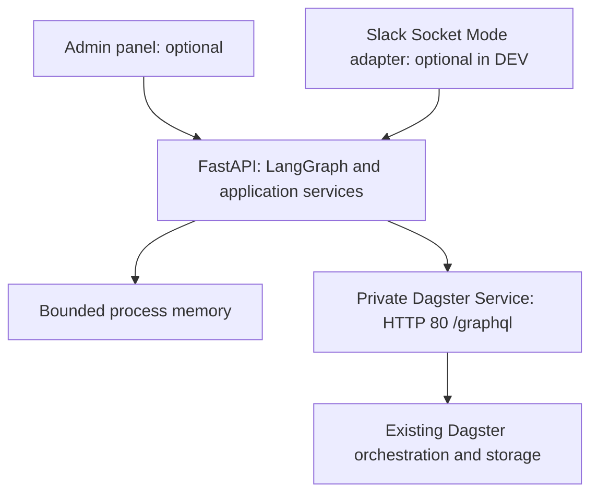
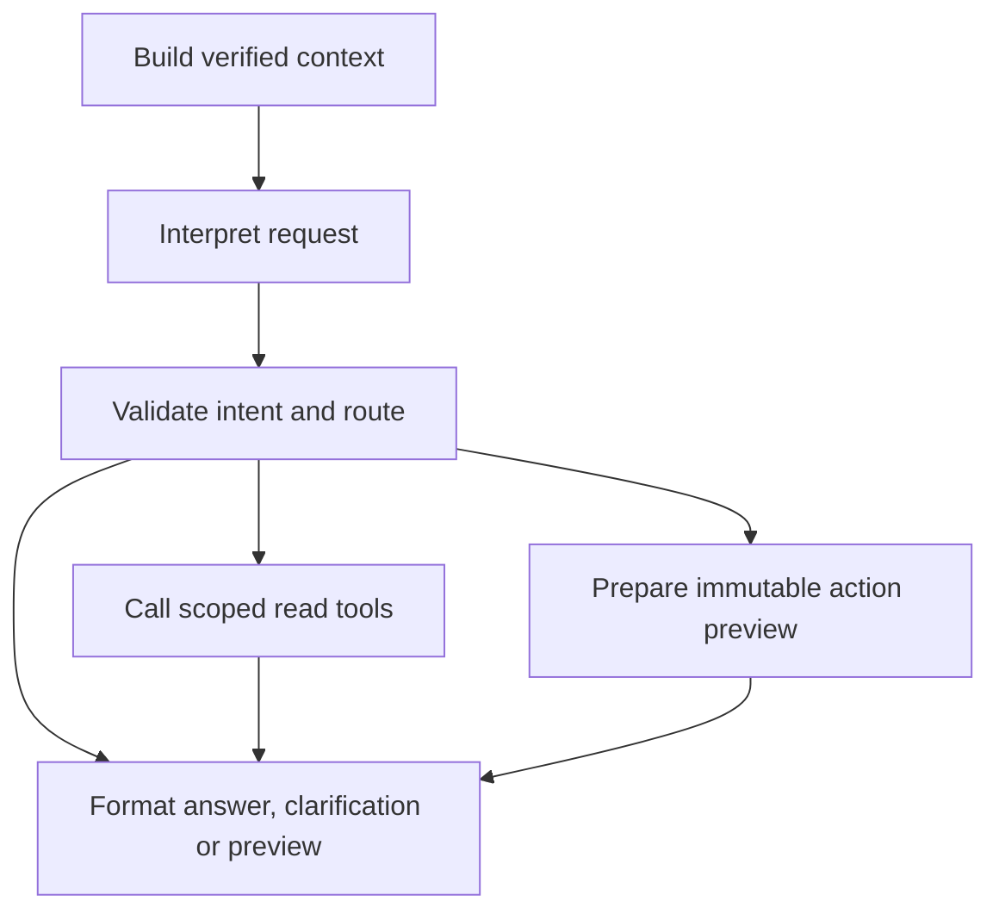

# Design

## Context

The bot and self-hosted Dagster share a Kubernetes cluster within each environment. Scope: one workspace, allowlisted channels, one PROD code location, approximately ten users and one hundred jobs, with isolated DEV configuration and an optional private admin panel in both environments. The [audit](environment-audit.md) records reported infrastructure facts and unresolved deployment checks.

**Adopted decision: no bot database or persistent work store.** Dagster's existing run records, queried through GraphQL, are the source of execution truth. The bot keeps only bounded process memory. This replaces the earlier PostgreSQL/two-replica design. Implementation remains pending; [specs](specs/) define behavior and [tasks](tasks.md) separate core/UI work from Slack integration.

## Goals / Non-Goals

Deliver deterministic in-thread operations and a minimal production admin panel using the same LangGraph workflow and application services. Preserve exact targets, requester confirmation, logical inputs/current code, and conservative handling of uncertain submissions. Phase one includes LangGraph and necessary tool-schema dependencies but excludes model-provider clients/calls/credentials, MCP, a broker, SQLite, Redis, persistent volumes/files, object-store ledgers, and Kubernetes objects used as an operation store or distributed lock. Do not access Dagster's database directly.

No durable request acceptance, restart-safe confirmations, guaranteed notification delivery, complete immutable audit, automatic mutation failover, or exactly-once execution is promised. Reads can resume automatically; every process restart requires operator reconciliation before mutations are re-enabled.

## Decisions

### Topology and work separation

Deploy one bot pod with one Uvicorn process. Use `replicas: 1`, `Recreate`, no HPA, and no overlapping releases targeting the same installation. This is an operational restriction, not remote fencing: `Recreate` does not prove a partitioned/deleted pod or its outstanding HTTP request has stopped. Replacement processes always start with mutations disabled, so operators must isolate prior submitters before arming the replacement.

Build the core and admin panel first. Slack is a separate adapter and implementation workstream, not another service. `SLACK_ENABLED=false` requires no Slack credentials, calls or healthy Slack connection. `ADMIN_UI_ENABLED` independently controls browser access in DEV and PROD; mock mode and simulated identities are DEV-only. The bot remains in a separate namespace; existing policy remediation is still required.

### Application contracts

FastAPI lifespan owns pooled async HTTPX clients, optional async Slack SDK clients, and supervised in-memory worker/polling tasks. Use bounded async work; no durable semantics are assigned to `BackgroundTasks`.

| Boundary | Contract |
|---|---|
| Transport adapter | Authenticate principal, establish conversation/turn context, render shared results |
| Actor context | Transport, authenticated principal, allowed environment/scope, authorization evidence and freshness |
| Conversation / turn | Stable scoped conversation key; separate event/request ID, current actor, boot and context revision |
| Target context | Exact run UUID/job/selection, trusted Slack root or explicit admin run/DEV fixture binding |
| Context builder | Versioned sanitized snapshot: target, source-attributed messages, fresh Dagster facts, completeness and budgets |
| Graph workflow | Compiled async LangGraph; bounded independent state for each authenticated turn |
| Model interfaces | Deterministic interpreter/formatter now; company-gateway implementations later, with the same typed contracts |
| Dagster tools | Typed scoped reads and action preparation; mutation execution stays in the confirmation service |
| Application services | Resolve, read, prepare, select mode, confirm, dispatch once, reconcile, observe |
| Dagster adapter | Pinned named GraphQL documents; separate bounded-read and submit-once paths |
| Result | Operation ID, boot ID, state, safe evidence, proposed controls and delivery context |

Shared services enforce capability/scope, current authorization, immutable preview, confirmation, admission, and execution checks. Slack membership verification and admin session authentication are transport-specific proofs; browser-provided Slack IDs are never authority. Both adapters invoke the same compiled graph with shared interpreter/result contracts. Only model-provider integration waits for phase two.

### LangGraph workflow and tools from phase one

Compile one async `StateGraph` during FastAPI lifespan and invoke it for every authenticated command using `ainvoke`, fresh per-turn state and trusted runtime context. Pin and test compatible package versions at implementation. No checkpointer, store, `interrupt`/resume approval, hosted graph server or implicit tracing is configured. Initial limits are 20 graph steps and a 30-second total turn budget; nested tool calls respect the smaller remaining budget. Tune these through DEV measurements. Do not globally retry a graph invocation; only explicitly safe reads may retry within existing bounds.

The graph ends after producing a typed result. Transport code renders it and attaches saved controls. Mandatory preview fields (target, mode, sanitized inputs, effects and warnings) and operation outcome fields come directly from immutable application-owned proposals/results; model prose may supplement but never replace or rewrite them. A human confirmation is a separate authenticated interaction handled directly by the existing confirmation/dispatch service, never interpreted as prose or resumed through the graph. Run polling and notifications also remain independent; no graph waits for a button click or job completion.

Implement functional placeholders: `interpret(turn, context)` uses the finite parser; `summarize(evidence, context)` uses deterministic evidence templates. They return typed results, explicit clarification or unsupported-language responses, never fabricated model output or a bare `pass`. A disabled provider adapter makes no network calls and reports unavailable if selected. Tests can inject scripted outputs. Later company-gateway implementations replace these functions without replacing Slack/UI routing, graph state, tool schemas or the action services; any added reasoning loops must retain bounded steps and permissions.

Wrap named Dagster operations in typed async tools with explicit input/output schemas, descriptions and read/preparation classification. Use minimal LangChain-core tool wrappers where needed; no general-purpose agent stack is required. Nodes may invoke these tools deterministically today; a later model can select only the allowed catalog. Business parameters such as run ID, retry mode or cursor are validated normally. Actor, scope, endpoint, credentials and destination come from server runtime context, never tool arguments or model-writable state.

| Tool class | Examples | Effect |
|---|---|---|
| Read | `get_run_status`, `get_failure_errors`, `get_redacted_config`, `list_runs`, `get_retry_family` | Scoped GraphQL queries returning sanitized structured evidence |
| Prepare | `prepare_retry`, `prepare_cancel`, `prepare_schedule_change` | Existing application preparation; bounded RAM proposal only, no Dagster mutation |
| Internal execution | `submit_once` with validated approved operation | Confirmation service only; absent from graph/model tool catalog |

Do not expose `execute_graphql(query)` or automatically wrap every schema mutation. Repeated preparation for the same current-boot request/intent returns its retained proposal/status rather than minting new approvals; expiry or changed intent requires the normal fresh-request rules. Preparation has no automatic node retry. Keep secrets, full execution inputs and confirmation nonces in application services; graph state contains sanitized evidence and opaque proposal references. Never emit raw graph state through tracing/streaming: output schemas and private graph channels are not a redaction boundary.

### Conversation context and future LLM integration

Use a canonical conversation key scoped by installation, environment and transport. For Slack include workspace ID, channel ID and original root timestamp; retain timestamps as strings. Participants share the conversation but each turn has its own authenticated requester and event ID. A run ID, user ID or message text alone is not a conversation key. Replies use the saved channel and root `thread_ts`, with broadcasting disabled; model output cannot choose destinations. The admin panel uses server-issued session/conversation IDs in a separate namespace.

Build a versioned `ContextSnapshot` from the verified root/current request, explicit target, bounded source-attributed dialogue when enabled, fresh Dagster evidence and allowed capabilities. Record source IDs, observed times, context revision and missing/truncated sections. Phase one needs the root, current command and run facts; optional dialogue retrieval is behind a context-provider interface. Later use `conversations.replies` only for the authorized thread, with pagination, applicable token scopes/rate limits, and configured message/byte/time/token budgets. Do not scan channels or fetch attachments/URLs. Preserve who said what: human suggestions and prior bot prose are conversation data, not Dagster facts or authorization. An incomplete transcript requires clarification for ambiguous references, never a guessed target.

Cache sanitized context in bounded RAM only. Refresh permissions and evidence before use; ignore stale/deleted/edited cached text when detected. Summaries are disposable derived context with source references, never approvals, run status or durable checkpoints. On a fresh authenticated turn after restart, reverify the root and rebuild run facts from Dagster and available dialogue from Slack only when dialogue retrieval is enabled; retention, missing scopes or deleted messages can prevent full recovery. Admin dialogue is lost unless supplied again as an explicit fixture. No cross-thread or cross-user preference store is introduced.

Serialize context updates per conversation within bounded intake, without holding the context lock while awaiting human input or job completion. Each clarification/response/proposal is tied to its triggering actor/request and context revision; a delayed model result cannot overwrite newer context or mutate another requester's proposal. Context-dependent intent must be revalidated against current evidence before preparation. This ordering does not replace runtime admission or requester-only confirmation. Even in phase two, unmentioned replies provide context only; a new bot turn requires an explicit mention or a valid bound interaction.

A graph execution ID remains separate from the stable conversation key. Each turn supplies rebuilt context without checkpoint resumption; a framework `thread_id` neither routes Slack replies nor authenticates users. Durable graph resumption would require a separately approved persistence change; it is not part of this database-free design.

The future model client uses only the company AI gateway, after approved redaction and disclosure policy, with bounded calls/tokens/time and deterministic command fallback. No hosted agent service, LangSmith tracing or external telemetry is required or enabled by default. Graph tools may read evidence or request application-owned preparation; they cannot invoke mutations, confirm controls, arm recovery, execute arbitrary GraphQL/shell, change scope or fabricate actor identity. Treat messages, logs and summaries as untrusted data; validate tool inputs and distinguish evidence-backed observations from hypotheses. Phase two still requires gateway integration and injection, attribution, ambiguity, replay and quality tests before enablement; adopting LangGraph now reduces restructuring, not this validation work.

### Minimal implementation layout and conventions

Create implementation files only when their task begins. Use Python 3.12, `pyproject.toml`, one `uv.lock`, snake_case functions/modules, PascalCase typed models and uppercase enum values. Pin compatible versions once exercised together; do not use floating image/package tags. Dependencies are FastAPI/Uvicorn, Pydantic settings, HTTPX, LangGraph with minimal LangChain-core tools, Jinja2, Authlib and the async Slack SDK. No ORM, repository abstraction, dependency-injection framework, generic agent stack or migration directory. Tests use pytest/pytest-asyncio and HTTPX; browser acceptance uses Python Playwright. Ruff formats/lints; mypy checks application types. Do not impose test coverage targets that reward implementation-mirroring tests.

| Path under `src/slackbot/` | Sole responsibility |
|---|---|
| `main.py` | App factory, lifespan and route registration; one Uvicorn worker |
| `config.py` | Validated settings and immutable environment/capability policy |
| `models.py` | Public request/result/error schemas and canonical enums |
| `auth.py` | Admin OIDC/DEV sessions, roles and CSRF; trusted actor construction |
| `dagster.py` | Named GraphQL documents, response unions, read retries and single submission |
| `tools.py` | Thin typed read/preparation wrappers; no duplicated business rules |
| `workflow.py` | Six nodes: build_context, interpret, route, read, prepare, format; parser/templates and replaceable model interfaces |
| `service.py` | Target validation, logical input preservation, previews, confirmations and observation |
| `runtime.py` | Bounded RAM registries, request reservation, locks, workers and mutation gate |
| `web.py` | Admin routes and typed HTTP adapter |
| `slack.py` | Socket Mode, thread identity, membership and Block Kit adapter |
| `operator.py` | Local recovery CLI/socket, not an HTTP endpoint |
| `templates/admin.html`, `static/admin.css`, `static/admin.js` | One shell and small static assets |

This is the initial layout, not a requirement to keep growing modules unsplit. Keep dependencies directional: adapters → workflow/tools → service → Dagster; service uses runtime/models, never imports an adapter. Pure formatting and domain functions need no class unless carrying dependencies/state. External I/O is async and cancellable. Pydantic models forbid extra fields and validate UUIDs, bounds and discriminated unions; trusted runtime context is created by the server, not deserialized from client/model input. Do not return raw exception strings or use `Any` to bypass external-boundary validation.

### Configuration contract

| Setting | Meaning/default |
|---|---|
| `APP_ENV` | Required `dev` or `prod` |
| `DAGSTER_MODE` | `live`; `mock` allowed only in DEV |
| `INSTALLATION_ID` | Required stable per-environment identity |
| `DAGSTER_GRAPHQL_URL`, `DAGSTER_AUTH_MODE` | Controlled URL; audited mode `network_only` |
| `DAGSTER_CODE_LOCATION`, `DAGSTER_REPOSITORY` | Required deployed scope; audited values below |
| `ENABLED_CAPABILITIES` | Explicit command allowlist; mutations disabled by default and still require operator arming |
| `ADMIN_UI_ENABLED`, `SLACK_ENABLED` | Independent booleans, both default false; startup needs at least one enabled transport except tests |
| `ADMIN_AUTH_MODE` | `oidc`; DEV-only `local` for test login |
| `OIDC_ISSUER`, `OIDC_CLIENT_ID`, `OIDC_CLIENT_SECRET`, `OIDC_REDIRECT_URI` | Required for healthy enabled OIDC; validate within the admin adapter, disabling its access on absence without failing healthy Slack/core startup; platform-supplied |
| `ADMIN_VIEWER_SUBJECTS`, `ADMIN_OPERATOR_SUBJECTS` | Exact subject lists for configured issuer; empty by default, operator precedence |
| `ALLOWED_HOSTS`, `ADMIN_ORIGIN` | Exact browser host/origin allowlists; HTTPS in PROD |
| `DEV_LOGIN_SECRET` | Required only for DEV/local; never valid in PROD |
| `SLACK_BOT_TOKEN`, `SLACK_APP_TOKEN`, `SLACK_WORKSPACE_ID`, `SLACK_CHANNEL_IDS`, `SLACK_PUBLISHER_IDS` | Required only when Slack enabled; publisher IDs captured/verified from real alerts |
| `CORRELATION_HMAC_KEY` | Secret stable key for safe fingerprints; rotation requires reconciliation |

Owner-maintained presets and asset mappings are read-only deployment config, validated at startup; never writable through the panel. Missing optional mappings disable only their feature. There is no database URL or config flag that arms writes at startup. `DAGSTER_MODE=mock` instantiates only the fixture client and must not load real Dagster/Slack credentials. Slack delivery testing uses live DEV separately. Operational defaults below are typed constants until measurement justifies exposing a setting; avoid dozens of unnecessary env vars.

### Command and tool contract

The graph interpretation node normalizes text or validated structured forms to `Command(name, args)` before routing. Text uses `shlex.split` only for tokenization, never shell execution. Command/flag names and mode values are case-insensitive; job/sensor names, preset IDs, partition keys and asset path components retain case. Reject duplicate/unknown flags and surplus arguments. Double/single quotes support spaces. Timestamps use RFC 3339 UTC; Slack timestamps remain exact strings. Asset keys use the canonical JSON string-array returned by listings. Forms send typed arrays directly.

| Text grammar | Structured name / arguments | Service tool |
|---|---|---|
| `help`, `health`, `capabilities` | Same name, no args | `get_help`, `get_health`, `get_capabilities` |
| `jobs` | `jobs`, page args | `list_jobs` |
| `runs`, `failed` | Same name; optional `job`, `status`, `since`, `until`, page args; failed fixes FAILURE | `list_runs` |
| `status`, `logs`, `config` | Same name; optional `run_id`, page args for logs | `get_run_status`, `get_failure_errors`, `get_redacted_config` |
| `retry [--run UUID] [--mode reexecute\|fresh]` | `retry`; optional run_id/mode | `prepare_retry` |
| `launch NAME --preset ID [--partition KEY]` | `launch`; job, preset, optional partition | `prepare_launch` |
| `cancel [UUID]` | `cancel`; optional run_id | `prepare_cancel` |
| `assets`, `asset KEY` | `assets` page args; `asset` asset_key | `list_assets`, `get_asset` |
| `partitions NAME --type job\|asset` | `partitions`; target_type, job or asset_key, page args | `list_partitions` |
| `materialize KEY --partition KEY` | `materialize`; asset_key, partition | `prepare_materialization` |
| `schedules`, `sensors` | Same name, page args | `list_schedules`, `list_sensors` |
| `schedule start\|stop NAME`, `sensor start\|stop NAME` | `schedule`/`sensor`; action, name | `prepare_schedule_change`, `prepare_sensor_change` |
| `operation UUID` | `operation`; operation_id | `get_operation` |
| `bind UUID` | `bind`; run_id; Slack only | `prepare_binding` |

For status/logs/config, text `--run UUID` chooses an explicit target; omission requires the bound run. List flags are `--job`, `--status`, `--since`, `--until`, `--limit` and `--cursor` as applicable. Page arguments are `limit` (default 25, maximum 100) and opaque `cursor`. Cursors bind to actor scope, command and filter fingerprint; changed filters invalidate them. A missing retry mode returns a mode-choice result, never launches. Selecting a mode submits a fresh preparation request. There are no text `confirm` or `arm` commands. Every preparation call validates capabilities, authorization and the full target. `get_retry_family` is a shared evidence helper, not an extra user command. Tool names are stable in this table; the GraphQL adapter owns actual document names.

For example, text `asset '["warehouse", "orders"]'` and structured command `{"name":"asset","args":{"asset_key":["warehouse","orders"]}}` select the same asset. The outer single quotes preserve JSON quotes during text tokenization; forms send the array without text parsing.

### Request, state and HTTP contracts

Use UUID strings for request, operation, conversation and boot IDs. One operation record covers one accepted command or proposal; no separate proposal database/model is needed. `OperationState` is `RECEIVED`, `PREPARING`, `AWAITING_CONFIRMATION`, `DISPATCHING`, `TRACKING`, `COMPLETED`, `REJECTED`, `EXPIRED`, `DISCARDED` or `SUBMISSION_UNKNOWN`. Dagster's verified status is a separate `dagster_status`; `COMPLETED` means the bot finished observing and does not mean the job succeeded. Busy/capability/auth failures are error codes, never Dagster statuses. `MutationGate` is `DISARMED` or `ARMED` with a reason and current boot ID.

Browser request IDs and server operation/conversation/boot IDs use UUIDv4. Normalize a Slack mention's request ID with Python `uuid5(NAMESPACE_URL, name)`, where `name` is `json.dumps([INSTALLATION_ID, APP_ENV, "slack", workspace_id, event_id], separators=(",", ":"), ensure_ascii=True)`. Exclude boot and Socket Mode envelope IDs so redelivery retains identity. Missing event identity rejects the command; do not substitute a random UUID. Button interactions use the retained operation and single-use control, not a new command ID.

Normal reads: RECEIVED → PREPARING → COMPLETED. Actions: RECEIVED → PREPARING → AWAITING_CONFIRMATION → DISPATCHING → TRACKING → COMPLETED. Preparation may end REJECTED; open previews may enter EXPIRED or DISCARDED. An uncertain dispatch becomes SUBMISSION_UNKNOWN and closes the mutation gate; positive reconciliation can attach a run and resume TRACKING without resending. Proven no-side-effect rejections become REJECTED. Gate reopening always requires explicit operator action. Proposal creation and AWAITING_CONFIRMATION are stored atomically; later graph formatting failure preserves the recoverable immutable preview and expiry.

Already-terminal cancellation and already-desired schedule/sensor state are explicit no-ops: fresh authorized evidence moves PREPARING or AWAITING_CONFIRMATION directly to COMPLETED, invalidates controls and reports that no mutation was sent. This is the only changed-target-state exception to requiring a fresh preview; other material changes reject the old preview.

`CommandRequest` has `request_id`, optional `conversation_id`, and exactly one of `text` (1–2,000 characters) or `command: {name, args}`. Per-command arguments use the typed union above; no arbitrary JSON/configuration field exists. `ConversationRequest` selects no target (catalog context) or an exact scoped `run_id`; the server generates its ID. `ConfirmationRequest` has `boot_id` and opaque `confirmation_token`; the path chooses the retained operation. Actor/session/scope never come from a body.

Every `/api/v1` JSON response has `{data, error, request_id}` (echo the client command UUID, or generate a correlation UUID for other requests) with exactly one non-null data/error. `error` is `{code, message, retryable}` with safe text. `Operation` includes operation_id, boot_id, state, command, target, created_at, updated_at, expires_at if awaiting confirmation, sanitized result, observed_at, partial, and next_cursor where applicable. `result.type` is answer/list/detail/choice/preview/clarification; preview includes required immutable fields. Eligible current-session requesters receive confirmation controls as an adapter-owned response field, never graph/model data. No missing operation is represented as a negative Dagster result.

| HTTP endpoint | Contract |
|---|---|
| `GET /admin`, `GET /admin/static/{asset}` | Shell/assets only when enabled; unauthenticated shell shows sign-in, no operational data |
| `GET /auth/login`, `GET /auth/callback` | OIDC browser flow; exact registered callback |
| `POST /auth/logout`, DEV-only `POST /auth/dev` | End session; DEV local secret login with same-origin pre-auth protection |
| `GET /api/v1/bootstrap` | Current actor/role, boot, environment/mode, enabled capabilities, gate, CSRF token and safe connection state |
| `POST /api/v1/conversations` | Create server-bound context; 201 with conversation_id |
| `POST /api/v1/commands` | Atomically reserve request then queue; 202 with operation_id/state and `Location` polling URL |
| `GET /api/v1/requests/{request_id}` | Recover authorized receipt/current operation after lost command response |
| `GET /api/v1/operations` | Session-scoped Activity across views, optional conversation_id plus limit/cursor; no durable-history claim |
| `GET /api/v1/operations/{operation_id}` | Current authorized state/result; GET never executes work |
| `POST /api/v1/operations/{operation_id}/confirm` | Fresh checks and one-use confirmation; 202 for accepted dispatch, no graph invocation |
| `POST /api/v1/operations/{operation_id}/discard` | Discard only an open proposal; 200; distinct from canceling a Dagster run |
| `GET /health/live`, `/health/ready`, `/metrics` | Internal probes/telemetry; network-restricted, no operational evidence or public secrets |

All operational browser API calls require session authorization. All browser POSTs require appropriate CSRF and Origin/Host checks, including read commands that create volatile operation records. Poll operations at 1 second while queued/preparing, 5 seconds while tracking, then stop at resolved states; pause hidden pages and back off on dependency errors. List refresh is an explicitly new read request, never replay of a mutation. Public API docs are disabled in PROD; OpenAPI remains available to authenticated operators for contract review. Authentication routes validate browser-bound pre-auth state before issuing a session; DEV local login uses a one-use pre-auth CSRF value.

Reserve `(boot, transport, principal, session-or-Slack-workspace, request_id)` before enqueue. Same key and canonical submitted-payload/context/target fingerprint returns retained state (200), does not enqueue again or extend expiry; different fingerprint returns 409 REQUEST_ID_CONFLICT. Fingerprint validated structured input with sorted keys or exact submitted text; exclude volatile timestamps and secrets. Concurrent duplicates use one atomic get-or-create. Cached results still require current authorization. UI supplies a UUID before POST and uses the request lookup after uncertain receipt; it never auto-resends. Confirmation duplicates by the original authorized requester return retained state without another POST to Dagster; other users cannot consume approval. Unavailable/aged-out records return 404 CONTEXT_UNAVAILABLE with no assertion about prior execution. Reauthentication invalidates old controls and needs a new request/preview.

HTTP error mapping: 401 AUTH_REQUIRED; 403 FORBIDDEN or CSRF_FAILED; 404 CONTEXT_UNAVAILABLE; 409 REQUEST_ID_CONFLICT, BUSY, PREVIEW_CHANGED, ALREADY_SUBMITTED, MUTATIONS_DISABLED or REAUTH_REQUIRED; 410 PREVIEW_EXPIRED; 422 INVALID_COMMAND or INVALID_TARGET; 429 CAPACITY_EXCEEDED with Retry-After; 503 DEPENDENCY_UNAVAILABLE, INCOMPLETE_EVIDENCE or CAPABILITY_UNAVAILABLE. Unknown dispatch is an operation state, not a retryable HTTP error. `retryable` allows a later read/new preparation only and never authorizes replay of confirmation/mutation. Use this envelope for FastAPI validation errors too; do not leak request values in error details.

### Bounded queries and evidence

Interactive lists use 25/100-item pages; structured events use 100/page with existing byte/frame bounds. One GraphQL response is capped at 1 MiB. Reads retry at most twice after the initial attempt with jitter (0.25–1 second), honoring Retry-After within the enclosing deadline; retry only transport/429/502/503/504 failures, not validation or unknown result types. Mutation retry count is zero. Interactive graph budget is 30 seconds/20 steps; target dispatch observations expire after five seconds. Background discovery is separate: 100 records/page, at most 20 pages or 30 seconds per pass, with at most 5,000 relevant references in RAM. Keep cursor and coverage between passes; restart discards them. Hitting a hard cap or missing a required page keeps launch admission closed and reports INCOMPLETE_EVIDENCE. Never equate visible table pages with complete safety discovery. Dependency errors produce stale/partial read results only where the selected response fields remain trustworthy; action checks require complete evidence.

### Private Dagster contract

Load the actual release-qualified URL from controlled deployment configuration: `http://<webserver-service>.<dagster-namespace>.svc.cluster.local:80/graphql`. The audited baseline is Dagster 1.13.1, HTTP port/target 80, network-only access without ingress or application auth proxy. Configure `DAGSTER_AUTH_MODE=network_only`; confirm actual workload connectivity and ambient mesh before enabling dispatch. No runtime Teleport tunnel or Kubernetes API access is needed.

Verify live location `k8s-example-user-code-1` and repository `__repository__`. Pin query inputs, selections and success/error unions against the installed schema. Check HTTP status, top-level errors and result `__typename`; HTTP 200 or a generic error does not establish the mutation outcome. Reject redirects and disable mutation retries throughout HTTP client, SDK, proxy and mesh. `stopRunningSchedule` is the schedule-stop mutation. Schema-present destructive/cursor operations remain outside the allowlist.

The instance defaults are DEV two / PROD three run retries with `retry_on_asset_or_op_failure: false`; supported per-run overrides and authoritative pending/exhausted evidence govern each action. Test ordinary op/dbt failure and worker-crash recovery separately. Dagster's 120-second monitor, 600-second start timeout and zero resume attempts remain independent of bot polling. Preserve concurrency tags and selection fidelity; a created run can remain queued. `logs` reads structured failures only: `NoOpComputeLogManager` provides no persisted stdout/stderr.

### Memory and correlation

| State | Lifetime / initial bound |
|---|---|
| Boot ID and mutation gate | Process lifetime; always disabled at startup |
| Command queue | 100 items; reject excess work explicitly |
| Event/request dedupe | 10,000 keys / 24 hours, bounded; not a restart guarantee |
| Thread/session bindings | 1,000 entries / 30 minutes idle; revalidate exact evidence on reuse |
| Prepared actions | 100 proposals, five-minute expiry; only current boot controls resolve |
| Admin sessions / login attempts | 100 each; session limits above, one-use auth attempts expire after five minutes |
| Operations | Active/unknown retained; up to 1,000 resolved records / 24 hours |
| Notifications | At most 100 redacted pending updates; coalesce by operation; 10 attempts or 15 minutes |

These are measured starting limits. Never evict unresolved mutation state to admit work; saturation disables new mutations and alerts. Expired controls, bindings and completed records may be discarded. Raw errors and execution inputs stay transient in RAM; redact before any output or telemetry. A restart can lose accepted work and delivery state, so callers may need a fresh status request.

For created runs, attach `opsbot/installation_id`, `opsbot/operation_id`, `opsbot/request_id`, `opsbot/source_run_id` when applicable, `opsbot/mode`, `opsbot/protocol_version`, and a safe intent fingerprint. Installation ID is stable per environment across deployments; never rotate it to evade old runs. Request ID derives deterministically from transport request identity, not transport envelope identity. Use a stable secret-backed HMAC for fingerprints of private context or inputs; never publish secrets, messages, raw configuration or Slack identities in tags. Key/installation changes require reconciliation of the old namespace of identifiers.

Tags aid positive discovery; they are not a unique constraint, idempotency key, historical command ledger, or atomic lock. Do not write pending operations into Dagster metadata through unsupported APIs. Failed commands and pre-run confirmations may leave no record. Dagster retention, external tag edits/deletion or restoration can remove evidence; missing evidence cannot establish a prior no-launch result.

### Preparation, confirmation and submission

1. Authenticate the caller and resolve the exact target. Fetch current source/configuration/selections, code compatibility, retry policy, previous attempts across both modes, and relevant active/pending families.
2. Prepare an immutable preview in memory. Show existing attempts, queueing, mode/lineage, inputs and effects. Repeating a completed prior attempt requires a fresh request and explicit acknowledgement; a duplicate request with a positively identified run returns that run. Active/pending/unknown attempts block a parallel launch.
3. Issue an opaque single-use control bound to boot ID, actor, transport/session/thread/card, mode, intent, preview and five-minute expiry. Lost/expired state cannot be reconstructed from the button alone. Validate the control on confirmation; consume it only at the final dispatch commitment.
4. Under a short lock, reserve the local family/target slot and mark confirmation processing for this operation; concurrent duplicate confirmations return its retained state. Release the lock before authorization and Dagster queries. Targeted authorization/source/family/code observations must be at most five seconds old at dispatch. Incomplete scans or an occupied slot return deferred/busy; material changes require a new preview, except verified no-ops. In a finally block under the lock, clear only this attempt's processing flag and release only its still-uncommitted reservation; preserve still-valid previews without extending expiry. There is no delayed launch queue.
5. Under the short lock shared with disarming, recheck boot identity, gate, operation ownership, state AWAITING_CONFIRMATION, this attempt's processing reservation, slot ownership, expiry, fresh evidence and unconsumed dispatch authority. Mark dispatch consumed and set `DISPATCHING`; release the lock and immediately await `submit_once` with no unrelated await between. Do not hold the lock during HTTP. Once authority is consumed, cancellation or process loss is conservatively unknown even if sending cannot be established. Gate closure prevents operations not yet committed to dispatch; it cannot retract a committed or already started request. Send at most one mutation request for that operation. A known successful response identifies the run; a proven no-side-effect rejection fails it. Timeout, disconnect, process cancellation or unclassified errors yield `SUBMISSION_UNKNOWN`, disable further mutations, and trigger observation/independent alerting.
6. Track the primary and actual automatic descendants through queueing, execution and retry gaps. Release local launch admission only after authoritative terminal/no-pending evidence. Notification failure cannot change this execution state.

Read scans use cursors, page/byte/time budgets, and the stable installation/source/request tags. Complete coverage must include terminal parents that can still spawn retries, not just active statuses or the latest page. If a bounded pass cannot complete, keep launch admission closed and continue a bounded reconciliation pass; never treat truncation, an arbitrary time window, or an empty result as proof of no prior submission. Startup/global discovery may continue across bounded passes; it is not required to finish within five seconds. Once complete, perform fresh targeted dispatch checks within that window. Recheck fresh relevant state after long passes. GraphQL reads and a later mutation are not an atomic transaction; external UI/schedule/daemon activity can still race.

Cancellation and automation changes use the same boot gate, confirmation and one-invocation rule, with per-target locks rather than acquiring a new-run slot. An uncertain older desired-state request blocks opposite changes; a single GET showing the desired value cannot prove that an older request is no longer in flight. Any uncertain mutation disables new mutations globally until resolved; reads and observation continue.

### Restart and operator recovery

The states below describe the bot operation independently of Dagster run status. Transport receipt is volatile; ACK is not durable acceptance. Restart discards operation/proposal state and creates a new boot ID with the gate closed for **all** mutations. Every rearm, including after in-process uncertainty is resolved, requires the operator procedure; observing completion never rearms automatically.

Startup queries Dagster for positively identifiable bot runs/families and exposes read-only diagnostics. Existing active families may be tracked but prevent another launch. Never replay commands, consume old confirmations, auto-post reconstructed notifications to unverified destinations, or automatically arm from an empty scan.

Provide a small operator CLI using a local Unix socket owned by the application account, accessed through the platform's audited exec workflow. Its `status`, `reconcile`, `disarm`, and `arm` actions target the current boot ID. `arm` requires an evidence/change reference and fresh completed checks. The platform exec audit authenticates the operator; a supplied name is contextual metadata, not authentication. There is no Slack/admin/public HTTP unlock or force-reset control.

Before arming, the operator must establish that previous submitters cannot send, account for outstanding remote requests, and resolve conflicting/uncertain operations using available Dagster and platform evidence. First commissioning records that no prior submitter exists. Restarts after cancellation/automation writes require equivalent reconciliation, not just a run search. Lack of conclusive evidence keeps mutations disabled; no timeout waives the gate. Arming with one known active family permits appropriate confirmed control of it but not a new launch. In-process positive reconciliation may resolve a known uncertain operation; a restart always requires explicit rearming.

### Admin panel, authentication and Slack

Serve one Jinja2 HTML shell at `/admin`, one CSS file and one JavaScript module. Use same-origin fetch and server-generated Pydantic/OpenAPI contracts; no React, frontend build, WebSocket server or second application. The six views, exact controls and accessibility behavior are specified in [admin-panel](specs/admin-panel/spec.md). Use a system font, neutral background, 8-pixel spacing scale, one restrained accent, 14–16-pixel body text, 44-pixel primary controls and text-labeled status badges. Desktop has a 224-pixel navigation rail and detail drawer; below 900 pixels use a menu and full-width detail view. Forms drive the complete catalog; a compact command input is secondary. Never expose raw graph traces or implementation jargon in normal user flows.

Production authentication uses Authlib for company OIDC authorization-code flow with PKCE S256. Use the configured discovery issuer and redirect URI, verify JWKS signature/allowed algorithms, issuer, audience/authorized party, expiry, nonce and single-use browser-bound state. Store state/verifier and opaque sessions in bounded RAM, not signed cookies containing tokens; implement Authlib's state storage through this RAM store. Exact issuer+subject allowlists grant `VIEWER` or `OPERATOR`; unknown subjects are denied. Operators include read permissions. Email/display name is presentation only. Return paths must be local allowlisted panel paths. No refresh tokens or local password database are needed. Use maintained Authlib APIs with a tested in-memory cache/session adapter; do not implement JWT cryptography or OAuth validation manually.

Sessions use a random 256-bit cookie value, HttpOnly, Secure in PROD, SameSite=Lax and Path=/; rotate on sign-in/reauthentication. Expire after 60 minutes absolute, 15 minutes user inactivity, or ID-token expiry, whichever is first. Explicit user commands/actions refresh idle activity; bootstrap/status/background polling does not. Automatic status polling does not extend idle expiry. PROD dispatch requires `auth_time` no older than five minutes; request `max_age=300` during reauthentication and verify actual `auth_time`, never token `iat`. Missing claims or old authentication block writes, preserving allowed reads. Reauthentication invalidates old session-bound proposals; users prepare and confirm again. Logout invalidates the session and open proposals but never terminates Dagster work. There is no promise of instantaneous IdP account revocation between validations; observed revocation denies immediately and session/token expiry bounds retained access.

State-changing requests require a session CSRF token plus exact allowed Origin/Host. Disable CORS; return JSON 401 for expired API sessions, not login HTML. OIDC callback codes/state must be removed from access logs and cleared by redirect. Apply no-store to operational responses, CSP restricting scripts/styles/connect to self, frame-ancestors none, and nosniff; render untrusted text through escaping/textContent. No CDN assets, browser-stored credentials or external tracing. Production access requires approved private TLS routing or Teleport Application Access with the registered HTTPS callback; that access pattern remains a platform release gate. Plain localhost HTTP is DEV-only. Configured TLS proxy headers are trusted only from known proxies.

`/auth/dev` is available only in DEV with explicit local authentication; a POSTed secret maps to a fixed configured principal. Mock actors/fault injection additionally require mock mode. No browser control can change backend/environment. When admin authentication is unavailable, browser operational routes deny access and report degraded admin health; valid Slack/core behavior remains available. Incorrect global scope or PROD mock configuration fails startup.

Slack retains outbound Socket Mode and authenticated membership checks. It resolves the trusted root button `http://127.0.0.1:8080//runs/<full-uuid>` without fetching it, then supplies the same graph turn contract. Its confirmation cards call the same confirmation service as the panel. UI identity does not impersonate Slack membership, and Slack-only `bind` has no admin equivalent. See [slack-operations](specs/slack-operations/spec.md).

### Deployment and observability

Use the existing ACD/ArgoCD, image and ExternalSecrets conventions. Satisfy actual Kyverno compliance labels and registry rules; verify image pull and startup separately from manifest admission. Keep production identifiers and credentials outside the public repository.

Platform/Dagster owners must add webserver-only ingress TCP 80 from the bot namespace AND pod labels in the same peer, preserving existing allowed traffic. Configure bot egress to DNS, Dagster, Slack when enabled, configured OIDC endpoints when the panel is enabled, and required platform telemetry. Verify effective additive policies from real allowed and denied workloads. Port-forward success and the failed audit probe do not establish successful bot connectivity. Resolve ambient-mesh behavior; absent sidecars/labels are insufficient proof.

Expose internal liveness, readiness, dependency diagnostics and metrics. Readiness follows enabled adapters, initialization and supervised loops; mutation readiness is reported separately and may remain closed while reads work. No database probe or unconditional Slack dependency exists. Unexpected loop exit terminates the process; dependency outages back off without restart storms. SIGTERM closes intake and mutation admission, stops new work and drains bounded calls, never cancels Dagster runs.

Initial defaults: four safe workers, one local mutation dispatcher; HTTP connect/pool 2 s, read/write 10 s, total 15 s, pool 10; run polling 15 s with jitter; shutdown grace 45 s. Tune bounded scans from DEV measurements. Independent platform monitoring observes connectivity, queue saturation, unknown submissions, rearm requirement, mutation-gate age, reconciliation lag and delivery drops. Emit redacted structured command/approval/submission/outcome/recovery events with boot/operation/request IDs; log actor identifiers only in approved redacted form. Existing log retention is owner-managed and is not a durable coordination mechanism.

## Risks / Trade-offs

- **Availability:** one process and an operator rearm after restart replace automatic mutation failover. The single Dagster webserver is another dependency failure point. Reconcile its DEV replica drift; do not advertise inherited HA or an unverified end-to-end SLO.
- **Uncertainty:** extra GraphQL checks reduce risk but cannot eliminate races or guarantee exactly-once launches. Unknown outcomes may require prolonged read-only operation.
- **Loss:** volatile acknowledgements, confirmations, manual bindings, pre-run audit and pending notifications may be lost. Dagster can recover run facts, not every bot interaction.
- **External changes:** run retention/tag changes and Dagster storage incidents can remove evidence. Disarm on detected gaps/restoration until reconciled; do not assume negative queries prove absence.

## Migration Plan

1. Implement the compiled LangGraph workflow, deterministic model placeholders, typed tools, mocked Dagster adapter and admin panel in DEV without Slack/model credentials or database infrastructure.
2. Close admission/image/network gates and verify live DEV reads, exact scope and redaction.
3. Implement confirmed actions, discovery, uncertainty and restart recovery; exercise loss/crash/race scenarios before enabling writes.
4. Build Slack intake, binding, membership and rendering as a separate workstream using the tested services.
5. Deploy PROD read-only; validate enabled panel OIDC/roles and Slack/network/Dagster contracts, operator recovery and owner approvals; enable tested capabilities deliberately. Rollback disarms and stops the old process, then starts the replacement read-only.

## Open Questions

Remaining release evidence includes OIDC registration/subject allowlists/private callback routing and: exact workload/admission selectors and registry access; mesh behavior; full schema/retry/selection/tag fixtures; Slack identities/payload/scopes; data retention/redaction approval; operator exec audit and stale-submitter isolation procedure; actual single-webserver availability expectation; optional presets/mappings. These are release gates for affected features, not reasons to fabricate successful tests or provision a bot database.

## References

- [Dagster GraphQL](https://docs.dagster.io/api/graphql): verify the installed 1.13.1 schema and result contracts.
- [Slack Socket Mode](https://docs.slack.dev/apis/events-api/using-socket-mode/) and [Events API](https://docs.slack.dev/apis/events-api/).
- [Slack thread retrieval](https://docs.slack.dev/reference/methods/conversations.replies/) and [reply routing](https://docs.slack.dev/reference/methods/chat.postMessage/).
- [LangGraph Graph API](https://docs.langchain.com/oss/python/langgraph/graph-api), [tools](https://docs.langchain.com/oss/python/langchain/tools) and [persistence](https://docs.langchain.com/oss/python/langgraph/persistence): compile a deterministic workflow now, without checkpointing or model-provider calls.
- [Kubernetes deployment strategies](https://kubernetes.io/docs/concepts/workloads/controllers/deployment/#strategy) and [NetworkPolicy](https://kubernetes.io/docs/concepts/services-networking/network-policies/).

- [FastAPI templates](https://fastapi.tiangolo.com/advanced/templates/), [Authlib Starlette integration](https://docs.authlib.org/en/stable/oauth2/client/web/starlette.html), [OIDC Core](https://openid.net/specs/openid-connect-core-1_0.html), and [WCAG 2.2](https://www.w3.org/TR/WCAG22/).
