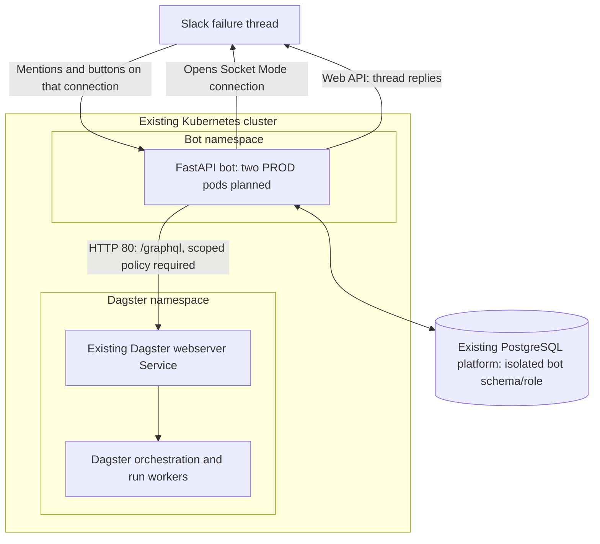

# Design

## Context

Dagster and FastAPI share a cluster within each environment; DEV and PROD use separate clusters. The [24 September infrastructure audit](environment-audit.md) supplies the reported deployment baseline and remaining gates. Scope: one workspace, allowlisted channels, one PROD code location, roughly ten users and one hundred jobs, with separate DEV configuration. Dagster already sends failure alerts and performs run retries.

This is an unimplemented design. [Proposal](proposal.md) defines scope; [capability specs](specs/) define behavior; [tasks](tasks.md) track implementation. Keep command semantics and acceptance scenarios in the specs rather than duplicating them here.

## Goals / Non-Goals

Provide reliable in-thread operations with a small deployment footprint. Phase one uses deterministic mentions and buttons. Exclude model dependencies, a separate broker/MCP service, local Dagster execution, and the destructive/bulk operations listed in the Dagster spec.

## Decisions

### Topology

| Choice | Reason and alternative |
|---|---|
| Existing private GraphQL endpoint | HTTP port 80, network-only access; Dagster retains execution ownership |
| Separate bot namespace | Matches companion applications; requires a narrow Dagster-side NetworkPolicy change before access |
| One FastAPI deployment | Current volume needs no separate gateway/worker deployments; split later only for measured contention |
| Two identical PROD replicas | Survives individual pod loss; DEV may use one |
| Slack SDK Socket Mode | Outbound HTTPS/WSS avoids public ingress; signed HTTPS callbacks remain an alternative transport |
| PostgreSQL ledger and work queue | Transactions coordinate receipts, confirmation and dispatch without another broker |
| Single automatic launch attempt | The deployed API does not establish a supported idempotency key; uncertainty requires reconciliation |

### Process and interfaces

Run one Uvicorn process per pod. FastAPI lifespan owns the async Slack SDK clients, pooled `httpx.AsyncClient`, Psycopg 3 `AsyncConnectionPool`, and supervised work/reconciliation/outbox tasks. Do not use synchronous I/O or FastAPI `BackgroundTasks` as the durable work store.

Use modules for transport, application services, Dagster adaptation, persistence and observability. They call each other directly. The application contracts are:

| Contract | Essential data |
|---|---|
| Actor context | Authenticated workspace/app/channel/user, event ID, command/root timestamps |
| Verified target | Environment, code location, repository/job, full run UUID, trusted-root evidence |
| Prepared action | Actor/target, operation/mode, immutable input and preview hashes, definition identity when available, expiry |
| Run snapshot | Status/timing, complete configuration/selection, partition metadata, lineage/retry state, relevant tags and code identity |
| Services | Receive, resolve, query, prepare, select mode, confirm, dispatch, reconcile, notify |

Policy belongs in application services, so future interfaces cannot bypass it. Phase-two model output can propose a typed intent; authenticated actor/context and confirmation remain application-owned.

### Slack integration

Configure separate DEV/PROD apps. Subscribe to `app_mention` and interactive buttons. Required credentials/scopes: app token `connections:write`; bot token `app_mentions:read`, `chat:write`, and public/private `channels:read/history` or `groups:read/history` variants actually needed. No user token, slash-command scope, general message subscription, file-upload scope or public-channel posting override is required.

The async SDK listener validates local envelope context, persists a deduplicated receipt or confirmation transaction, then sends `SocketModeResponse`. Never put history/membership/Dagster calls on this acknowledgement path. Unsupported/disallowed input is acknowledged and ignored promptly. Database failure means no claimed acceptance; manage Socket intake explicitly because Kubernetes readiness does not disconnect an outbound session.

Resolve the root using `conversations.history(channel, latest=root_ts, inclusive=true, limit=1)` and require its exact timestamp. Verify publisher IDs and extract the full UUID from the trusted `View in Dagster UI` button. The audited pattern is `http://127.0.0.1:8080//runs/<full-uuid>`: pin scheme/host/port/path, including the double slash, and validate a complete UUID; never fetch the link. The displayed first UUID segment is not identity. No publisher change is needed; capture a real payload to finalize publisher/app/channel IDs. Query only the configured Dagster endpoint. Use paginated `conversations.members` for requester membership; `conversations.info.is_member` describes the bot token holder.

Persist the root binding and post with `chat.postMessage(thread_ts=root_ts, reply_broadcast=false)`. Store the returned bot-message timestamp; update only bot-owned cards. Button values contain opaque operation/interaction references, not executable configuration. Untrusted publishers cannot use the manual-ID fallback. A private company-only channel is the default; shared channels are disabled unless explicitly configured.

### Dagster adapter

Load DEV/PROD `DAGSTER_GRAPHQL_URL` from controlled deployment configuration using the private audit inventory. Both observed Services are release-qualified ClusterIPs: `http://<webserver-service>.<dagster-namespace>.svc.cluster.local:80/graphql`, Service/target port 80, no ingress or application auth proxy. Use explicit `DAGSTER_AUTH_MODE=network_only`; require approved network restrictions and confirm ambient-mesh behavior. Never guess credentials or route via employee Teleport. PR previews require explicit isolated mappings and cannot inherit PROD settings.

Pin Dagster 1.13.1 as the audited baseline and validate live location `k8s-example-user-code-1` / repository `__repository__`; the source workspace's different name is not authoritative. The audit used port-forwards, so actual bot-pod DNS/Service access remains a release check. Check ready endpoints. Human access uses full run IDs and approved DEV/PROD port-forward instructions; do not advertise cluster DNS or the publisher's localhost button as a generally usable employee link.

Pin GraphQL documents and union mappings to the deployed schema; send named operations with variables. Check HTTP status, top-level GraphQL errors and result `__typename`. A generic error after run creation is not a proven rejection. Use `read()` and `submit_once()` paths so a read retry policy cannot reach launches. Disable launch retries in HTTPX and any proxy/mesh; reject redirects and verify TLS where configured.

Fetch complete source inputs. Re-execution/fresh-copy differences, supported selection fidelity, tag filtering, current-code conflicts and retry budgets are defined in `dagster-operations`. Contract-test both modes against real DEV workloads; do not infer them from the convenience client or UI fields. The adapter provides run/evidence lookup, plan validation, launch/re-execution, retry-family observation, operation-run discovery, cancellation and automation state control. Pin `stopRunningSchedule` for schedule stop; `stopSchedule` is absent. Introspection exposes excluded destructive/cursor operations too, so dispatch uses an allowlist, never schema-driven arbitrary execution.

The observed instance defaults are DEV two / PROD three automatic retries with `retry_on_asset_or_op_failure: false`. Resolve supported per-run tag overrides before previewing effective policy; do not hardcode defaults as remaining budgets. Verify ordinary op/dbt failure with no automatic run retry and worker-crash recovery with pending-child gaps. Run monitoring (600 s startup timeout, 120 s poll, zero resume attempts) can change status independently; bot polling cannot accelerate its detection. Preserve queue-policy tags and warn that creation can leave a run queued. `NoOpComputeLogManager` provides no persisted stdout/stderr: expose structured event failures only.

### Durable data model

Use an isolated bot schema and dedicated role on the existing PROD PostgreSQL platform, provisioned by its owner; a separate bot database is an acceptable platform choice. Restrict privileges and fix the search path so the bot cannot read/write Dagster tables. Never reuse Dagster credentials. The audited RDS endpoint suggests Aurora but does not prove engine, topology or durability. DEV currently hosts Dagster storage in one PostgreSQL pod; choose bot DEV storage explicitly and use a matching non-production failover topology for PROD recovery acceptance. Strings preserve Slack timestamps and IDs; timestamps use UTC. Foreign keys, unique logical keys and state-version checks enforce transitions.

| Table | Essential fields / constraint |
|---|---|
| `inbox_receipt` | Unique workspace/event or interaction identity; actor/thread; normalized command |
| `operation` | Kind/target/mode, state/version, preview/config hashes, confirmation/dispatch times, primary run, outcome |
| `confirmation` | Operation/requester, hashed nonce, preview version, expiry, consumed time |
| `dispatch_attempt` | Unique operation and dispatch ID; immutable request hash; submitter pod/process; lease generation; response evidence |
| `launch_slot` | Singleton `prod:<location>` key, owner operation/version, latest family observation |
| `work_item` | Unique logical work key, kind, ready time, lease owner/expiry/generation, attempts |
| `run_observation` | Operation/run IDs, lineage, status, retry linkage and observation time |
| `thread_binding` | Unique workspace/channel/root timestamp; source UUID, publisher, evidence hash |
| `slack_outbox` | Logical message/revision, operation/thread, delivery state, bot-message timestamp, retry time |
| `audit_event` | Append-only actor/target/decision, operation/trace ID, timestamp and state versions |
| `config_snapshot` | Restricted encrypted approved inputs, hash, key reference and purge time |

Audit permissions or external append-only export prevent ordinary application edits. Prefer faithful config references; otherwise encrypt snapshots with company key management and documented rotation. Retention and redaction rules belong to `slack-operations`.

### State transitions and execution

Normal path: `RECEIVED → PREPARING → NEEDS_MODE/AWAITING_CONFIRMATION → CONFIRMED → ADMITTED → DISPATCHING → TRACKING → terminal`. Proposals can expire/cancel; validation or busy admission can reject. `SUBMISSION_UNKNOWN`, `NEEDS_OPERATOR` and `AUTO_RETRY_PENDING` retain unresolved execution state. Delivery state is independent.

1. Prepare the exact action from current Dagster evidence and persist its preview. Confirmation atomically consumes the bound nonce, records approval and enqueues admission work.
2. Recheck current permission, configuration, source/retry state and preview. Lock the operation and singleton slot in a short transaction; reject a competing launch as busy.
3. Complete external prechecks without holding a database transaction. Require observations at most five seconds old at dispatch; if the preview changes, release an unused slot and request fresh confirmation.
4. Atomically verify admitted state, slot ownership and the current work-lease generation; commit a unique `DISPATCHING` marker. Send once only after a positively acknowledged marker commit. An uncertain commit forbids sending.
5. Record the known run/result, or retain the slot and reconcile uncertainty. Never reset a dispatched operation for another automatic attempt.

Claim safe work through short `FOR UPDATE SKIP LOCKED` transactions and increasing lease generations. Reads/preparation/outbox tasks can be retried after lease expiry. Dispatch cannot be reassigned for another launch. Database fencing cannot stop an already-authorized paused process from later sending to Dagster; retain submitter identity and append late response evidence without overwriting newer state.

Tag runs with `opsbot/operation_id`, `opsbot/dispatch_id` and `opsbot/source_run_id`. Reconciliation compares tags, target/configuration/selection and lineage; inherited tags may identify valid retry children rather than duplicate primaries. Track only the new primary's actual descendants. Empty searches, stuck unsubmitted runs or unobservable retry-pending state cannot justify automatic relaunch or slot release.

For operator recovery: disable dispatch; isolate the original submitter and account for in-flight requests; inspect supported Dagster evidence; attach the identified run or record a conclusive no-launch resolution; release the slot only after resolution. A desired new attempt uses a new confirmed operation. Restore or potentially lossy database promotion uses the same protected reconciliation gate.

Persist outbox work with the operation transition. Coalesce updates, respect `Retry-After`, and distinguish duplicate notification risk from execution deduplication. Schedule/sensor controls use per-definition serialization; uncertain opposite-state requests must not overtake each other.

### Lifecycle, deployment and configuration

At startup, validate settings/migrations and bot identity, open clients, recover work, start supervised loops, then connect Slack. An unexpected critical-loop exit closes intake and terminates the process. Dependency outages use backoff and health reporting; Dagster downtime must not create liveness restart storms.

On SIGTERM, mark not ready, disconnect intake, stop claims, drain bounded calls/transactions, preserve uncertain dispatch evidence, then close clients. Bot termination never cancels Dagster jobs. Database failure stops durable acceptance explicitly. Reserve reconciliation capacity so read traffic cannot starve active/unknown operations.

| Initial default | Value |
|---|---|
| Replicas / server workers | PROD 2, DEV 1; one process per pod |
| Safe work / dispatch executors | 4 / 1 per pod; global launch slot remains authoritative |
| Async DB pool | Min 2, max 10; at most 8 non-receipt acquisitions |
| Receipt DB deadline | 500 ms including pool, SQL and lock waits |
| HTTP timeouts / pool | Connect/pool 2 s; read/write 10 s; overall 15 s; max 10 connections |
| Work lease / heartbeat | 30 s / 10 s |
| Poll / status-update cadence | 15 s with jitter; terminal updates take priority |
| Shutdown grace | 45 s |
| Mutation defaults | Dispatch disabled; launch HTTP retries 0; from-failure disabled |

These are DEV-testable starting settings. Account for a temporary third rollout pod in database/cluster capacity. Spread replicas across nodes; use `minAvailable: 1`, `maxUnavailable: 0`, `maxSurge: 1`. Size resources from load/failure tests. Run migrations once through the deployment pipeline.

| Required configuration | Contents |
|---|---|
| Scope | Environment; isolated bot namespace; Slack workspace/app/bot/channel/publisher IDs; deployed Dagster location/repository |
| Endpoint contract | Private-inventory `DAGSTER_GRAPHQL_URL`; `DAGSTER_AUTH_MODE=network_only`; schema fingerprint; human port-forward instructions |
| Secrets | Dedicated Slack app/bot tokens, bot-role `DATABASE_URL`, encryption key reference; no invented Dagster API token |
| Policy | Confirmed redaction/retention settings, enabled capabilities, optional presets/mappings |

Deliver through the existing ACD/ArgoCD pipeline, environment image registry/tag conventions and ExternalSecrets/AWS Secrets Manager. Private deployment settings supply exact registry and secret references. Complete the internal example pipeline templates and render manifests before rollout. Give the bot its own tokens/role rather than the alert publisher's `SLACK_TOKEN` or Dagster service account. Keep secrets out of manifests/logs. Kubernetes service-account identity alone does not authenticate this HTTP endpoint.

The current Dagster policy selects all namespace pods and permits only same-namespace ingress. Platform/Dagster owners must change the private Dagster deployment chart/values in both environments: add a webserver-only ingress rule for TCP 80 from the exact bot namespace AND bot pod labels in the same `from` entry. Do not broaden the all-pod policy to the entire bot namespace. Preserve existing Dagster traffic; rules are additive, so inspect all effective policies and verify both allowed bot traffic and denied unrelated pod/namespace traffic. Application owners configure corresponding egress when isolated. This is a deployment prerequisite, not a bot startup workaround.

Allow bot egress to DNS, webserver, PostgreSQL, Slack HTTPS/WSS and required platform integrations. Verify real selectors, Service/target ports, CNI enforcement and ambient mesh. No sidecars were observed, but this does not prove absent ambient mTLS. NetworkPolicy cannot restrict GraphQL fields or universally filter external hostnames; retain application allowlists and use the approved egress proxy if required.

Use non-root containers, restricted secrets and no Kubernetes execution roles or shared Dagster-storage mounts. Disable service-account-token automount unless required by workload identity. Keep Dagster private. A private bot Service is only needed by internal HTTP/monitoring consumers; no public ingress is needed for Socket Mode.

### Health and observability

Expose internal `GET /health/live`, `/health/ready`, `/health/dependencies` and `/metrics`. Liveness observes the process/critical loops; readiness includes initialized state, writable storage, loops and Slack connectivity. Restrict dependency details and metrics. Only the optional HTTP transport adds signed `POST /slack/events`; there is no generic execution endpoint.

Both environments currently have one Dagster webserver replica, a dependency single point of failure for reads and dispatch even with two bot replicas. Reconcile DEV's declared two replicas versus live one before capacity/availability claims; do not silently change Dagster replica counts. Measure acknowledgement latency, oldest work/outbox age, connected sessions, slot age, unknown submissions, reconciliation lag, API/schema failures and redaction counts. Put operation IDs in logs/traces, not high-cardinality metric labels. Alert independently of the bot on lost connectivity/storage, unknown launches and stuck retry tracking. Performance/availability acceptance targets are in `execution-runtime`.

## Risks / Trade-offs

- **Unknown launch result:** blocking admission can delay recovery; only evidence/operator resolution can release it. No distributed exactly-once guarantee is claimed.
- **External Dagster activity:** bot locks do not serialize UI/schedule/sensor actions or atomically exclude a concurrent automatic retry. Broader exclusion requires Dagster-side coordination.
- **Lost acknowledged database state:** require verified failover durability or disable dispatch before recovery; an HA label is insufficient.
- **Shared cluster failure:** both apps can fail together. Independent alarms and the human Teleport/UI path remain necessary.
- **API/configuration drift:** pin installed contracts and disable incompatible capabilities. Current code and mutable external inputs do not guarantee historical replay.

## Migration Plan

1. Load the audited environment inventory, complete the cross-repository network change and bot database provisioning, and create DEV fixtures; keep dispatch disabled where evidence is missing.
2. Implement durable foundations, private reads and trusted thread resolution, then confirmed execution/recovery. Land tests with each feature.
3. Validate selection fidelity, duplicate delivery/clicks, concurrent confirmations, pod death around dispatch, unknown responses, retries, channel revocation, schema changes, database failover/restore and redaction.
4. Deploy PROD read-only; verify actual identities/network/data policy; enable tested logs/status/retry, then remaining catalog capabilities individually.
5. Record end-to-end acceptance and recovery-drill evidence before archiving the OpenSpec change. Planning completion does not mark implementation complete.

Rollback disables new dispatch and preserves the ledger, slot and reconciliation/outbox state. Use compatible schema migrations; never delete operation state to roll back. Existing runs continue under Dagster.

## Open Questions

Owners must supply these environment facts before affected production capabilities are enabled:

| Owner | Evidence |
|---|---|
| Dagster | Pinned 1.13.1 contract/selection fixtures, effective retry pending/budget evidence, launcher/image behavior and I/O manager |
| Platform | Narrow policy remediation, bot-pod connectivity, ambient mesh, DB engine/failover tests and schema/role, replica drift, secrets/keys, alarms and human access instructions |
| Slack | Allowed channel type/IDs, app/publisher identities and real alert payload matching the audited full-UUID button |
| Data/job owners | Redaction/retention approval, supported presets and asset mappings |

The adopted scope is one active bot-created family with pod-level resilience. A broader concurrency or outage requirement is a future design change. Do not substitute fabricated deployment values for missing evidence.

## References

- [Dagster GraphQL](https://docs.dagster.io/api/graphql) and [run retries](https://docs.dagster.io/deployment/execution/run-retries); verify the installed schema, not an assumed upstream release.
- [Slack async Socket Mode](https://docs.slack.dev/tools/python-slack-sdk/socket-mode/), [history](https://docs.slack.dev/reference/methods/conversations.history/), [membership](https://docs.slack.dev/reference/methods/conversations.members/), [thread messages](https://docs.slack.dev/reference/methods/chat.postMessage/).
- [FastAPI lifespan](https://fastapi.tiangolo.com/advanced/events/), [HTTPX async](https://www.python-httpx.org/async/), [Psycopg async pool](https://www.psycopg.org/psycopg3/docs/api/pool.html).
- [Kubernetes Services](https://kubernetes.io/docs/concepts/services-networking/service/) and [NetworkPolicy](https://kubernetes.io/docs/concepts/services-networking/network-policies/).
