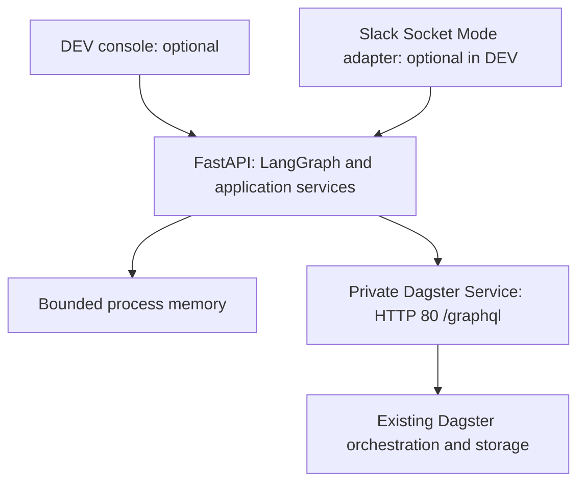
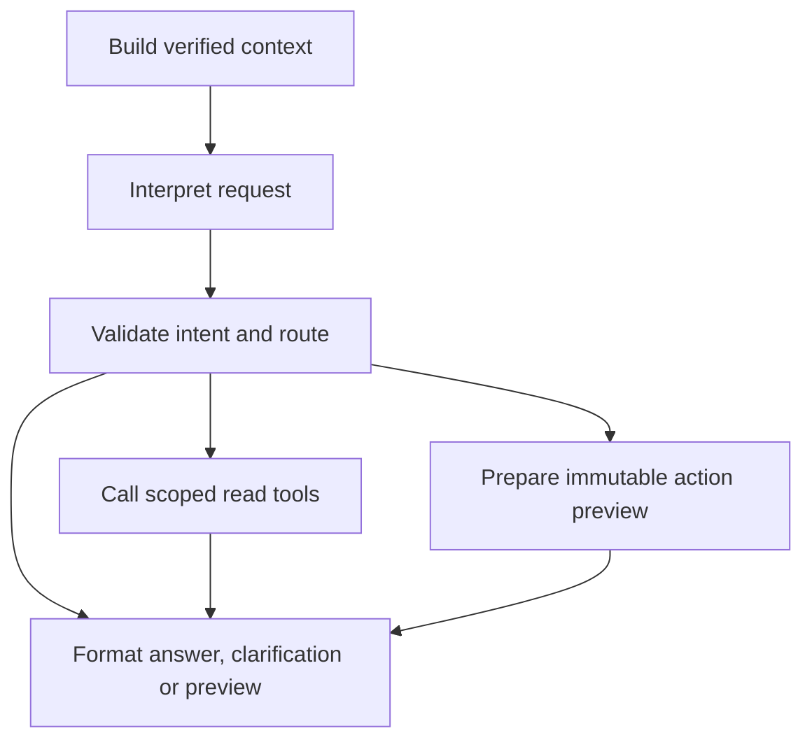

# Design

## Context

The bot and self-hosted Dagster share a Kubernetes cluster within each environment. Scope: one workspace, allowlisted channels, one PROD code location, approximately ten users and one hundred jobs, with isolated DEV configuration. The [audit](environment-audit.md) records reported infrastructure facts and unresolved deployment checks.

**Adopted decision: no bot database or persistent work store.** Dagster's existing run records, queried through GraphQL, are the source of execution truth. The bot keeps only bounded process memory. This replaces the earlier PostgreSQL/two-replica design. Implementation remains pending; [specs](specs/) define behavior and [tasks](tasks.md) separate core/UI work from Slack integration.

## Goals / Non-Goals

Deliver deterministic in-thread operations and a small DEV console using the same LangGraph workflow and application services. Preserve exact targets, requester confirmation, logical inputs/current code, and conservative handling of uncertain submissions. Phase one includes LangGraph and necessary tool-schema dependencies but excludes model-provider clients/calls/credentials, MCP, a broker, SQLite, Redis, persistent volumes/files, object-store ledgers, and Kubernetes objects used as an operation store or distributed lock. Do not access Dagster's database directly.

No durable request acceptance, restart-safe confirmations, guaranteed notification delivery, complete immutable audit, automatic mutation failover, or exactly-once execution is promised. Reads can resume automatically; every process restart requires operator reconciliation before mutations are re-enabled.

## Decisions

### Topology and work separation

Deploy one bot pod with one Uvicorn process. Use `replicas: 1`, `Recreate`, no HPA, and no overlapping releases targeting the same installation. This is an operational restriction, not remote fencing: `Recreate` does not prove a partitioned/deleted pod or its outstanding HTTP request has stopped. Replacement processes always start with mutations disabled, so operators must isolate prior submitters before arming the replacement.

Build the core and UI first. Slack is a separate adapter and implementation workstream, not another service. `SLACK_ENABLED=false` must require no Slack credentials, calls, or healthy Slack connection. PROD disables the DEV UI and mock backend. The bot remains in a separate namespace; existing policy remediation is still required.

### Application contracts

FastAPI lifespan owns pooled async HTTPX clients, optional async Slack SDK clients, and supervised in-memory worker/polling tasks. Use bounded async work; no durable semantics are assigned to `BackgroundTasks`.

| Boundary | Contract |
|---|---|
| Transport adapter | Authenticate principal, establish conversation/turn context, render shared results |
| Actor context | Transport, authenticated principal, allowed environment/scope, authorization evidence and freshness |
| Conversation / turn | Stable scoped conversation key; separate event/request ID, current actor, boot and context revision |
| Target context | Exact run UUID/job/selection, trusted Slack root or explicit DEV fixture/run binding |
| Context builder | Versioned sanitized snapshot: target, source-attributed messages, fresh Dagster facts, completeness and budgets |
| Graph workflow | Compiled async LangGraph; bounded independent state for each authenticated turn |
| Model interfaces | Deterministic interpreter/formatter now; company-gateway implementations later, with the same typed contracts |
| Dagster tools | Typed scoped reads and action preparation; mutation execution stays in the confirmation service |
| Application services | Resolve, read, prepare, select mode, confirm, dispatch once, reconcile, observe |
| Dagster adapter | Pinned named GraphQL documents; separate bounded-read and submit-once paths |
| Result | Operation ID, boot ID, state, safe evidence, proposed controls and delivery context |

Shared services enforce capability/scope, current authorization, immutable preview, confirmation, admission, and execution checks. Slack membership verification and DEV session authentication are transport-specific proofs; browser-provided Slack IDs are never authority. Both adapters invoke the same compiled graph with shared interpreter/result contracts. Only model-provider integration waits for phase two.

### LangGraph workflow and tools from phase one

Compile one async `StateGraph` during FastAPI lifespan and invoke it for every authenticated command using `ainvoke`, fresh per-turn state and trusted runtime context. Pin and test compatible package versions at implementation. No checkpointer, store, `interrupt`/resume approval, hosted graph server or implicit tracing is configured. Initial limits are 20 graph steps and a 30-second total turn budget; nested tool calls respect the smaller remaining budget. Tune these through DEV measurements. Do not globally retry a graph invocation; only explicitly safe reads may retry within existing bounds.

The graph ends after producing a typed result. Transport code renders it and attaches saved controls. Mandatory preview fields (target, mode, sanitized inputs, effects and warnings) and operation outcome fields come directly from immutable application-owned proposals/results; model prose may supplement but never replace or rewrite them. A human confirmation is a separate authenticated interaction handled directly by the existing confirmation/dispatch service, never interpreted as prose or resumed through the graph. Run polling and notifications also remain independent; no graph waits for a button click or job completion.

Implement functional placeholders: `interpret(turn, context)` uses the finite parser; `summarize(evidence, context)` uses deterministic evidence templates. They return typed results, explicit clarification or unsupported-language responses, never fabricated model output or a bare `pass`. A disabled provider adapter makes no network calls and reports unavailable if selected. Tests can inject scripted outputs. Later company-gateway implementations replace these functions without replacing Slack/UI routing, graph state, tool schemas or the action services; any added reasoning loops must retain bounded steps and permissions.

Wrap named Dagster operations in typed async tools with explicit input/output schemas, descriptions and read/preparation classification. Use minimal LangChain-core tool wrappers where needed; no general-purpose agent stack is required. Nodes may invoke these tools deterministically today; a later model can select only the allowed catalog. Business parameters such as run ID, retry mode or cursor are validated normally. Actor, scope, endpoint, credentials and destination come from server runtime context, never tool arguments or model-writable state.

| Tool class | Examples | Effect |
|---|---|---|
| Read | `get_run_status`, `get_failure_errors`, `get_redacted_config`, `list_runs`, `get_retry_family` | Scoped GraphQL queries returning sanitized structured evidence |
| Prepare | `prepare_retry`, `prepare_cancel`, `prepare_schedule_change` | Existing application preparation; bounded RAM proposal only, no Dagster mutation |
| Internal execution | `submit_once` with validated approved operation | Confirmation service only; absent from graph/model tool catalog |

Do not expose `execute_graphql(query)` or automatically wrap every schema mutation. Repeated preparation for the same current-boot request/intent returns its retained proposal/status rather than minting new approvals; expiry or changed intent requires the normal fresh-request rules. Preparation has no automatic node retry. Keep secrets, full execution inputs and confirmation nonces in application services; graph state contains sanitized evidence and opaque proposal references. Never emit raw graph state through tracing/streaming: output schemas and private graph channels are not a redaction boundary.

### Conversation context and future LLM integration

Use a canonical conversation key scoped by installation, environment and transport. For Slack include workspace ID, channel ID and original root timestamp; retain timestamps as strings. Participants share the conversation but each turn has its own authenticated requester and event ID. A run ID, user ID or message text alone is not a conversation key. Replies use the saved channel and root `thread_ts`, with broadcasting disabled; model output cannot choose destinations. DEV uses server-issued session/conversation IDs in a separate namespace.

Build a versioned `ContextSnapshot` from the verified root/current request, explicit target, bounded source-attributed dialogue when enabled, fresh Dagster evidence and allowed capabilities. Record source IDs, observed times, context revision and missing/truncated sections. Phase one needs the root, current command and run facts; optional dialogue retrieval is behind a context-provider interface. Later use `conversations.replies` only for the authorized thread, with pagination, applicable token scopes/rate limits, and configured message/byte/time/token budgets. Do not scan channels or fetch attachments/URLs. Preserve who said what: human suggestions and prior bot prose are conversation data, not Dagster facts or authorization. An incomplete transcript requires clarification for ambiguous references, never a guessed target.

Cache sanitized context in bounded RAM only. Refresh permissions and evidence before use; ignore stale/deleted/edited cached text when detected. Summaries are disposable derived context with source references, never approvals, run status or durable checkpoints. On a fresh authenticated turn after restart, reverify the root and rebuild run facts from Dagster and available dialogue from Slack only when dialogue retrieval is enabled; retention, missing scopes or deleted messages can prevent full recovery. DEV dialogue is lost unless supplied again as an explicit fixture. No cross-thread or cross-user preference store is introduced.

Serialize context updates per conversation within bounded intake, without holding the context lock while awaiting human input or job completion. Each clarification/response/proposal is tied to its triggering actor/request and context revision; a delayed model result cannot overwrite newer context or mutate another requester's proposal. Context-dependent intent must be revalidated against current evidence before preparation. This ordering does not replace runtime admission or requester-only confirmation. Even in phase two, unmentioned replies provide context only; a new bot turn requires an explicit mention or a valid bound interaction.

A graph execution ID remains separate from the stable conversation key. Each turn supplies rebuilt context without checkpoint resumption; a framework `thread_id` neither routes Slack replies nor authenticates users. Durable graph resumption would require a separately approved persistence change; it is not part of this database-free design.

The future model client uses only the company AI gateway, after approved redaction and disclosure policy, with bounded calls/tokens/time and deterministic command fallback. No hosted agent service, LangSmith tracing or external telemetry is required or enabled by default. Graph tools may read evidence or request application-owned preparation; they cannot invoke mutations, confirm controls, arm recovery, execute arbitrary GraphQL/shell, change scope or fabricate actor identity. Treat messages, logs and summaries as untrusted data; validate tool inputs and distinguish evidence-backed observations from hypotheses. Phase two still requires gateway integration and injection, attribution, ambiguity, replay and quality tests before enablement; adopting LangGraph now reduces restructuring, not this validation work.

### Private Dagster contract

Load the actual release-qualified URL from controlled deployment configuration: `http://<webserver-service>.<dagster-namespace>.svc.cluster.local:80/graphql`. The audited baseline is Dagster 1.13.1, HTTP port/target 80, network-only access without ingress or application auth proxy. Configure `DAGSTER_AUTH_MODE=network_only`; confirm actual workload connectivity and ambient mesh before enabling dispatch. No runtime Teleport tunnel or Kubernetes API access is needed.

Verify live location `k8s-example-user-code-1` and repository `__repository__`. Pin query inputs, selections and success/error unions against the installed schema. Check HTTP status, top-level errors and result `__typename`; HTTP 200 or a generic error does not establish the mutation outcome. Reject redirects and disable mutation retries throughout HTTP client, SDK, proxy and mesh. `stopRunningSchedule` is the schedule-stop mutation. Schema-present destructive/cursor operations remain outside the allowlist.

The instance defaults are DEV two / PROD three run retries with `retry_on_asset_or_op_failure: false`; supported per-run overrides and authoritative pending/exhausted evidence govern each action. Test ordinary op/dbt failure and worker-crash recovery separately. Dagster's 120-second monitor, 600-second start timeout and zero resume attempts remain independent of bot polling. Preserve concurrency tags and selection fidelity; a created run can remain queued. `logs` reads structured failures only: `NoOpComputeLogManager` provides no persisted stdout/stderr.

### Memory and correlation

| State | Lifetime / initial bound |
|---|---|
| Boot ID and mutation gate | Process lifetime; always disabled at startup |
| Command queue | 100 items; reject excess work explicitly |
| Event/request dedupe | 10,000 keys / 24 hours, bounded; not a restart guarantee |
| Thread/session bindings | 1,000 entries / 30 minutes idle; revalidate exact evidence on reuse |
| Prepared actions | 100 proposals, five-minute expiry; only current boot controls resolve |
| Operations | Active/unknown retained; up to 1,000 resolved records / 24 hours |
| Notifications | At most 100 redacted pending updates; coalesce by operation; 10 attempts or 15 minutes |

These are measured starting limits. Never evict unresolved mutation state to admit work; saturation disables new mutations and alerts. Expired controls, bindings and completed records may be discarded. Raw errors and execution inputs stay transient in RAM; redact before any output or telemetry. A restart can lose accepted work and delivery state, so callers may need a fresh status request.

For created runs, attach `opsbot/installation_id`, `opsbot/operation_id`, `opsbot/request_id`, `opsbot/source_run_id` when applicable, `opsbot/mode`, `opsbot/protocol_version`, and a safe intent fingerprint. Installation ID is stable per environment across deployments; never rotate it to evade old runs. Request ID derives deterministically from transport request identity, not transport envelope identity. Use a stable secret-backed HMAC for fingerprints of private context or inputs; never publish secrets, messages, raw configuration or Slack identities in tags. Key/installation changes require reconciliation of the old namespace of identifiers.

Tags aid positive discovery; they are not a unique constraint, idempotency key, historical command ledger, or atomic lock. Do not write pending operations into Dagster metadata through unsupported APIs. Failed commands and pre-run confirmations may leave no record. Dagster retention, external tag edits/deletion or restoration can remove evidence; missing evidence cannot establish a prior no-launch result.

### Preparation, confirmation and submission

1. Authenticate the caller and resolve the exact target. Fetch current source/configuration/selections, code compatibility, retry policy, previous attempts across both modes, and relevant active/pending families.
2. Prepare an immutable preview in memory. Show existing attempts, queueing, mode/lineage, inputs and effects. Repeating a completed prior attempt requires a fresh request and explicit acknowledgement; a duplicate request with a positively identified run returns that run. Active/pending/unknown attempts block a parallel launch.
3. Issue an opaque single-use control bound to boot ID, actor, transport/session/thread/card, mode, intent, preview and five-minute expiry. Lost/expired state cannot be reconstructed from the button alone. Approval consumes the nonce atomically under the process lock.
4. Acquire the local launch-admission lock. Recheck authorization and Dagster evidence; observations must be at most five seconds old when used for dispatch. Incomplete scans, changed source/inputs/code/prior attempts, or an occupied family return deferred/busy or require a new preview. There is no delayed launch queue.
5. Under synchronization shared with disarming, recheck boot identity, gate, operation ownership and unconsumed dispatch authority. Consume authority and start `submit_once` without an intervening asynchronous wait. Gate closure prevents later submissions but cannot retract an already started request. Send at most one mutation request for that operation. A known successful response identifies the run; a proven no-side-effect rejection fails it. Timeout, disconnect, process cancellation or unclassified errors yield `SUBMISSION_UNKNOWN`, disable further mutations, and trigger observation/independent alerting.
6. Track the primary and actual automatic descendants through queueing, execution and retry gaps. Release local launch admission only after authoritative terminal/no-pending evidence. Notification failure cannot change this execution state.

Read scans use cursors, page/byte/time budgets, and the stable installation/source/request tags. Complete coverage must include terminal parents that can still spawn retries, not just active statuses or the latest page. If a bounded pass cannot complete, keep launch admission closed and continue a bounded reconciliation pass; never treat truncation, an arbitrary time window, or an empty result as proof of no prior submission. Recheck fresh relevant state after long passes. GraphQL reads and a later mutation are not an atomic transaction; external UI/schedule/daemon activity can still race.

Cancellation and automation changes use the same boot gate, confirmation and one-invocation rule, with per-target locks rather than acquiring a new-run slot. An uncertain older desired-state request blocks opposite changes; a single GET showing the desired value cannot prove that an older request is no longer in flight. Any uncertain mutation disables new mutations globally until resolved; reads and observation continue.

### Restart and operator recovery

State transitions are `PREPARING → AWAITING_CONFIRMATION → CONFIRMED → DISPATCHING → TRACKING → terminal`, with `BUSY`, `EXPIRED`, `SUBMISSION_UNKNOWN` and `NEEDS_OPERATOR` branches. Transport receipt is volatile; ACK is not durable acceptance. Process restart discards these states and creates a new boot ID with the gate closed for **all** mutations.

Startup queries Dagster for positively identifiable bot runs/families and exposes read-only diagnostics. Existing active families may be tracked but prevent another launch. Never replay commands, consume old confirmations, auto-post reconstructed notifications to unverified destinations, or automatically arm from an empty scan.

Provide a small operator CLI using a local Unix socket owned by the application account, accessed through the platform's audited exec workflow. Its `status`, `reconcile`, `disarm`, and `arm` actions target the current boot ID. `arm` requires an evidence/change reference and fresh completed checks. The platform exec audit authenticates the operator; a supplied name is contextual metadata, not authentication. There is no Slack/DEV-UI/public HTTP unlock or force-reset control.

Before arming, the operator must establish that previous submitters cannot send, account for outstanding remote requests, and resolve conflicting/uncertain operations using available Dagster and platform evidence. First commissioning records that no prior submitter exists. Restarts after cancellation/automation writes require equivalent reconciliation, not just a run search. Lack of conclusive evidence keeps mutations disabled; no timeout waives the gate. Arming with one known active family permits appropriate confirmed control of it but not a new launch. In-process positive reconciliation may resolve a known uncertain operation; a restart always requires explicit rearming.

### DEV UI and Slack adapters

Serve a minimal HTML/CSS/JavaScript page from FastAPI at `/dev`, with typed `/dev/api/*` routes for session, command submission, operation polling, mode selection, confirmation and proposal cancellation. No separate frontend deployment or production execution API is introduced. Render a thread-like panel and reuse the exact service previews/results. Display mock/live-DEV mode and current mutation gate. UI retries must never replay a mutation POST automatically.

Mock mode uses curated sanitized fixtures and injectable test identities with no real backend calls. Live DEV uses a server-authenticated session, fixed DEV scope and fixed configured principal; simulation identities are unavailable. Use a short-lived, process-memory session cookie, HttpOnly/SameSite=Strict, CSRF protection and Origin/Host checks; Secure cookies on TLS, with explicit loopback-HTTP allowance for local development. Authenticate using a DEV-only secret through a POST, never URL parameters or browser local storage. The initial principal represents the holder of this DEV credential, not a claimed Slack identity. Private access and platform port-forwarding are sufficient; do not add public ingress. PROD startup rejects UI/mock configuration and does not mount those routes/assets.

Slack uses outbound Socket Mode and Web API thread replies. Acknowledge promptly after bounded volatile intake, then perform root/membership/Dagster calls. Parse the trusted alert's `http://127.0.0.1:8080//runs/<full-uuid>` button; never fetch it. The existing publisher need not change. Publisher/workspace/channel IDs and actual payloads remain required. Re-resolve roots after memory loss; unverifiable edits and conflicts fail closed. Details belong to [Slack requirements](specs/slack-operations/spec.md), and UI acceptance to [DEV workbench requirements](specs/dev-workbench/spec.md).

### Deployment and observability

Use the existing ACD/ArgoCD, image and ExternalSecrets conventions. Satisfy actual Kyverno compliance labels and registry rules; verify image pull and startup separately from manifest admission. Keep production identifiers and credentials outside the public repository.

Platform/Dagster owners must add webserver-only ingress TCP 80 from the bot namespace AND pod labels in the same peer, preserving existing allowed traffic. Configure bot egress to DNS, Dagster, Slack when enabled, and required platform telemetry. Verify effective additive policies from real allowed and denied workloads. Port-forward success and the failed audit probe do not establish successful bot connectivity. Resolve ambient-mesh behavior; absent sidecars/labels are insufficient proof.

Expose internal liveness, readiness, dependency diagnostics and metrics. Readiness follows enabled adapters, initialization and supervised loops; mutation readiness is reported separately and may remain closed while reads work. No database probe or unconditional Slack dependency exists. Unexpected loop exit terminates the process; dependency outages back off without restart storms. SIGTERM closes intake and mutation admission, stops new work and drains bounded calls, never cancels Dagster runs.

Initial defaults: four safe workers, one local mutation dispatcher; HTTP connect/pool 2 s, read/write 10 s, total 15 s, pool 10; run polling 15 s with jitter; shutdown grace 45 s. Tune bounded scans from DEV measurements. Independent platform monitoring observes connectivity, queue saturation, unknown submissions, rearm requirement, mutation-gate age, reconciliation lag and delivery drops. Emit redacted structured command/approval/submission/outcome/recovery events with boot/operation/request IDs. Existing log retention is owner-managed and is not a durable coordination mechanism.

## Risks / Trade-offs

- **Availability:** one process and an operator rearm after restart replace automatic mutation failover. The single Dagster webserver is another dependency failure point. Reconcile its DEV replica drift; do not advertise inherited HA or an unverified end-to-end SLO.
- **Uncertainty:** extra GraphQL checks reduce risk but cannot eliminate races or guarantee exactly-once launches. Unknown outcomes may require prolonged read-only operation.
- **Loss:** volatile acknowledgements, confirmations, manual bindings, pre-run audit and pending notifications may be lost. Dagster can recover run facts, not every bot interaction.
- **External changes:** run retention/tag changes and Dagster storage incidents can remove evidence. Disarm on detected gaps/restoration until reconciled; do not assume negative queries prove absence.

## Migration Plan

1. Implement the compiled LangGraph workflow, deterministic model placeholders, typed tools, mocked Dagster adapter and DEV console without Slack/model credentials or database infrastructure.
2. Close admission/image/network gates and verify live DEV reads, exact scope and redaction.
3. Implement confirmed actions, discovery, uncertainty and restart recovery; exercise loss/crash/race scenarios before enabling writes.
4. Build Slack intake, binding, membership and rendering as a separate workstream using the tested services.
5. Deploy PROD read-only; validate real Slack/network/Dagster contracts, operator recovery and owner approvals; enable tested capabilities deliberately. Rollback disarms and stops the old process, then starts the replacement read-only.

## Open Questions

Only environment evidence remains: exact workload/admission selectors and registry access; mesh behavior; full schema/retry/selection/tag fixtures; Slack identities/payload/scopes; data retention/redaction approval; operator exec audit and stale-submitter isolation procedure; actual single-webserver availability expectation; optional presets/mappings. These are release gates for affected features, not reasons to fabricate successful tests or provision a bot database.

## References

- [Dagster GraphQL](https://docs.dagster.io/api/graphql): verify the installed 1.13.1 schema and result contracts.
- [Slack Socket Mode](https://docs.slack.dev/apis/events-api/using-socket-mode/) and [Events API](https://docs.slack.dev/apis/events-api/).
- [Slack thread retrieval](https://docs.slack.dev/reference/methods/conversations.replies/) and [reply routing](https://docs.slack.dev/reference/methods/chat.postMessage/).
- [LangGraph Graph API](https://docs.langchain.com/oss/python/langgraph/graph-api), [tools](https://docs.langchain.com/oss/python/langchain/tools) and [persistence](https://docs.langchain.com/oss/python/langgraph/persistence): compile a deterministic workflow now, without checkpointing or model-provider calls.
- [Kubernetes deployment strategies](https://kubernetes.io/docs/concepts/workloads/controllers/deployment/#strategy) and [NetworkPolicy](https://kubernetes.io/docs/concepts/services-networking/network-policies/).
